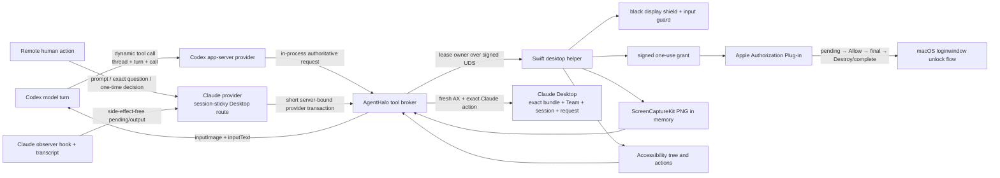
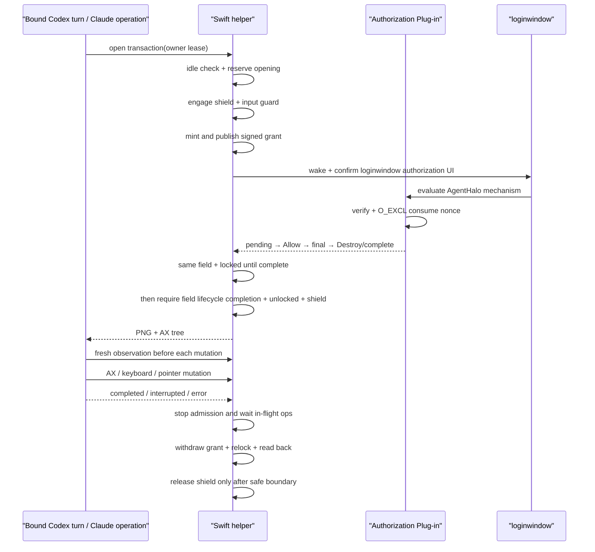

# Computer Use 与 Locked Use

本文描述 AgentHalo 的 macOS computer use，以及在机器已锁屏、现场无人时继续让
大模型截图和操作界面的 Locked Use。产品语义参考
[ChatGPT Locked Use](https://learn.chatgpt.com/docs/computer-use#locked-use)，系统集成使用
Apple 的 [Authorization Plug-in](https://developer.apple.com/documentation/security/extending-authorization-services-with-plug-ins)。

AgentHalo fresh-install 配置模板默认显式开启两个功能；如果配置块缺失，运行时仍按
fail-closed 处理：

- `computer_use.enabled` 打开普通桌面操作；
- `computer_use.locked_use.enabled` 允许受信任 Codex turn 或 server-bound Claude
  provider transaction 参与锁屏解锁；
- 能力只由目标机本地 config 和管理员安装授予，网络请求不能安装 plug-in 或提升配置上限；
- `computer_use.debug_http_actions` 继续默认关闭，锁屏操作只能走绑定权威 Codex turn
  或 Claude operation 的进程内 broker。

Apple 产品身份以 `dev.linsheng.agenthalo` 为根：Go agent 使用根 identifier，
desktop helper/LaunchAgent 使用 `.desktop`，Authorization Plug-in 使用
`.locked-use.plugin`，authorization child rule 使用 `.locked-use`。新安装只使用
`agenthalo` service/relay、AgentHalo state/socket 和 `AGENTHALO_*` 环境变量；
安装前必须先用旧版自带的卸载器完整移除旧产品，不做原地迁移。

## 安全定义

Locked Use 不是通用远程解锁，也不是登录密码托管。一次允许的窗口必须满足：

1. 请求来自 provider 协议确认的当前 active Codex model turn，或 server 创建且绑定
   exact Claude logical/native session 的短时 operation；
2. 物理显示器在撤锁前已经遮黑，物理输入 tap 已生效；
3. Apple Authorization Plug-in 验证并原子消费本 turn 的短时签名 grant；
4. root-context plug-in 为本 nonce 写入 pending/final/complete proofs；`complete` 只能由成功 Allow 对应的 `MechanismDestroy` 写入；
5. `complete` 前 loginwindow 的 exact password field 持续是同一 AX element 且系统保持 locked；仅在 `complete` 后才接受该 element 的 lifecycle completion 与实际 unlocked；
6. 所有操作都仍属于同一个 turn/operation；
7. turn/operation 结束、TTL、本地输入、遮罩/进程/系统状态异常时，撤 grant 并确认
   重新锁屏。

总不变量是：**不确定就拒绝或重锁，不能“记录错误后继续”。**

## 总体拓扑



Go agent 不持有登录密码，也不直接改桌面。Swift helper 不提供“unlock” socket op；它只
能唤醒 loginwindow 并确认其授权控件。是否撤锁由 macOS authorization engine 和已安装
plug-in 决定。

## 权威操作绑定

### Codex dynamic tools

AgentHalo 为**新建 Codex thread**在 `thread/start` 注册 `computer_use` namespace：

| Tool | 作用 |
|---|---|
| `get_app_state` | 自动建立本 turn 的唯一 Locked Use window，返回 PNG 与目标 app AX tree |
| `press` | 对最新 AX path 执行 press |
| `set_value` | 对最新 AX path 写值；允许空字符串清空输入框 |
| `click` | 点击 composite PNG 的左上角原点坐标 |
| `type_text` | 输入文本 |
| `press_key` | 输入单键或组合键 |
| `scroll` | 在 composite PNG 的左上角原点坐标滚动 |

Provider 从 app-server request 自己取得 `generation/threadId/turnId/callId`，并同时校验：

- 当前 app-server generation；
- 该 thread 是本 generation 新建并实际拿到 dynamic tools 的 thread；
- thread 当前 active，且 turn→thread 映射完全一致；
- 不在 interrupt/terminal 状态；
- 最近一次 `get_app_state` 已成功，且 AX mutation 的 app 与该次检查目标一致。

模型参数不能覆盖 provider/session/thread/turn 身份。tool callback 直接进入同进程 broker，
不绕回 HTTP。provider terminal、interrupt、error 或 app-server loss 会撤 lease、等待在途
操作结束、关闭窗口并重锁。

一次 `get_app_state` 只授权**一次**后续 mutation；mutation 在进入 broker 前原子消费这份
观察能力（并发调用最多一条通过），之后必须重新截图/读 AX。这样 UI 改变后不能继续沿用
旧坐标或旧 index path 盲操作。

Codex `thread/resume` 目前不能安全补发 thread-only dynamic tools，因此不宣称支持。

### Claude provider transaction

Claude 不把 PWA 参数伪装成 model turn，也不让 observer hook 自己取得桌面能力。
canonical `claude` 的每个 logical session 持久化 session-sticky route：fresh session
默认 `desktop_computer_use`；`stream_json_cli` 只允许在任何 UI mutation 之前的
capability preflight 失败时，为该 fresh session 选定一次。

Desktop route 的 prompt input、`AskUserQuestion` answer 和 Claude tool allow/deny
进入一个 server 创建的短时进程内 transaction：

1. API 从持久 record 恢复 provider + logical/native session + Desktop alias；调用方
   不能覆盖这些 identity，也不能自报 turn/lease id；
2. server 生成随机 operation id 和短时 lease，并固定 configured Claude bundle id、
   Team id、session id；question/permission 还固定 exact pending request id；
3. capability、owner、locked/shield/input-guard preflight 在任何 app activate、focus、
   set-value、press、click、type 或 key mutation 前完成；
4. 每个 mutation 前读取 fresh screenshot + AX tree；一次 mutation 消费一次
   observation，第二个 mutation 必须重新观察；
5. transaction 同步停止 admission、等待在途动作、close、撤 grant、relock 并 read
   back，全部完成后调用才返回。Claude model 运行和 observer polling 期间保持锁屏。

fallback 是 pre-mutation route selection，不是 retry。session 已有 Desktop owner、
发生或可能发生过任何 UI mutation、local physical input、bundle/Team/session/request
不匹配、shield/lock state 不确定等安全拒绝，均不得改走 CLI。投递是否发生不确定时返回
`delivery_unknown`；禁止重复发送 prompt、答案或 allow/deny。

Claude 的 observer hook、turn-state 和 transcript 只承担无副作用 discovery/read side。
`/status`、`/output`、native list、preview、push/stream polling 不得打开 window 或撤锁；
只有 prompt delivery 或远端人类携 exact request id 的 `/question_answer` / `/approval`
可以开始 transaction。模型不能给自己授权。

`allow` 仅能选择当前 Claude tool request 的最小一次性权限（“Allow Once”）。AX 必须
匹配 exact card/tool/request 并确认 control enabled；若界面只提供 Always、session-wide、
修改默认策略或其他扩大范围的允许方式，则 fail closed。`deny` 也只能作用于 exact
request。

本文中的 Claude “授权”不包括 macOS 登录密码、Touch ID、TCC/Accessibility/Screen
Recording、账号登录、SSO、MFA 或恢复码。AgentHalo 不读取、保存、输入或代替人工批准
这些系统/身份认证。

### HTTP 边界

普通未启用 Locked Use 的 computer use 仍保留现有 HTTP 兼容面。设备一旦配置
`locked_use.enabled=true`，以下 HTTP 操作默认返回 `403 model_tool_required`：

- window open；
- action；
- AX read/mutation。

window close 始终允许，因为它只能撤权和重锁。设备本地可以显式设置
`computer_use.debug_http_actions=true` 做人工调试；这会削弱“只有权威绑定的
turn/operation 能操作”的边界，生产环境必须保持 false。Claude provider transaction 也不使用这些 HTTP
routes；它与 Codex dynamic tool 一样只调用进程内 broker。

## Authorization Plug-in

### authorizationdb 形状

在当前 macOS 上，`system.login.screensaver` 是 `class=rule`、`k-of-n=1` 的 rule 列表。
安装器创建：

```text
dev.linsheng.agenthalo.locked-use
  class = evaluate-mechanisms
  mechanisms = [AgentHaloLockedUse:invoke,privileged]
  shared = false
  timeout = 0
  tries = 1
```

再对精确 AgentHalo 子规则去重并把它固定放在整个 `rule` 列表的 index 0，使
Computer Use + Locked Use 成为第一求值分支。其他插件规则和
`use-login-window-ui` 普通密码分支一个不删、相对顺序不变。结果是：

- 有效 grant：AgentHalo 分支 Allow，本次解锁获得授权；
- 无效/缺失 grant：该分支 Deny，求值继续到正常登录窗口；
- 正常密码分支永远保留，因此安装后仍可人工解锁。

安装后的 live readback 必须同时证明：AgentHalo 子规则只出现一次且位于 index 0、
`use-login-window-ui` 仍存在，并且安装前所有非 AgentHalo 规则仍以原相对顺序存在。
重复执行安装器必须得到完全相同的 rule 顺序。

安装器仍显式写入 `timeout=0`。macOS 26.5.2 的 `authd` 在回读这个
`evaluate-mechanisms` rule 时会省略该键，因此安装器和 preflight 只接受“键缺失”或
“整数 0”；任何非零值或错误类型仍失败关闭。`shared=false` 防止一次 Allow 进入全局
credential cache、被后续
authorization instance 重用；`tries=1` 限制同一 authorization transaction 只求值一次，
原子消费 nonce 和 root-owned ledger 再阻止同一 grant 在同一事务或后续事务中重放。这三层
不能互相替代。

如果目标系统不是安装器明确支持的 `rule` 或 `evaluate-mechanisms` 形状，安装器拒绝修改，
而不是猜测一个 authorizationdb 布局。

### Grant 契约

grant 使用 ECDSA P-256，签名覆盖：

| 字段 | 约束 |
|---|---|
| `v` | 固定为 grant v2 |
| `purpose` | 固定 `screensaver-unlock` |
| `nonce` | 16 随机字节，32 个小写 hex 字符 |
| `device_id` | 与安装时目标设备一致 |
| `turn_id` | 审计归属 |
| `console_uid` / `console_username` | helper 必须是当前 primary console user；两项同时匹配本次 authorization transaction username 及其 passwd UID |
| `issued_at` / `expires_at` | 有效期 > 0 且不超过 15 秒 |

Plug-in 的检查顺序：签名 → schema/设备/主体/新鲜度 → `O_EXCL` 原子消费 nonce →
写 root-owned exact-nonce `receipt.pending` → `SetResult(Allow)` → 写 final `receipt` →
成功 Allow 对应的 `MechanismDestroy` 写终态 `receipt.complete`。从第一次读取 grant
到 final proof 完成持有 shared fd lock；controller 撤销 grant 必须取得 exclusive
lock，随后再从磁盘复核三份 proof。任何读取、owner/mode、symlink、长度、签名、
主体、时钟、ledger 或 proof 写入失败都失败关闭；final 存在但 complete 缺失也不得开窗。

helper 不能靠“屏幕变成 unlocked”认领成功：真人、Apple Watch 或另一个授权分支可能
恰好获胜。`receipt.complete` 前，exact `UserPasswordTextField` 必须持续是同一
AX element，且屏幕必须一直 locked；仅在 complete 之后，才接受该 element
失效/完成与 unlocked 状态的组合。complete 前发生的 alternate unlock 必须重锁并
进入 quarantine，不能被归因到本 turn。

### 密钥

grant 私钥保存在当前用户的 file-based login Keychain：

- 只有显式执行 `--provision-locked-use-key --config <path>` 时才允许创建缺失的 key；
- 首次创建使用 Keychain 默认 creator ACL，把 item 绑定到已安装 helper 的
  code-signing designated requirement；不使用 restricted keychain access-group entitlement；
- 正常运行时只读取既有 key，禁止认证 UI；缺失、不可访问或 ACL 不匹配都失败关闭，
  不删除、不轮换 key；
- helper 与 agent 必须使用同 Team 和固定 signing identifier；
- plug-in 只安装对应 public key，公钥不能签发 grant。

provisioning 命令只创建缺失的 key（或读取既有 key）并输出 public-key JSON；不锁屏、
不启动服务、不接触登录密码。AgentHalo 没有 plaintext key 文件或旧产品 key 导入路径。
屏幕锁定与 login Keychain 锁定是两套状态：helper 启动时会读取 key 并驻留内存；如果
login Keychain 被手工或策略锁定后 helper 需要重启，key 将不可读，Locked Use 必须
fail closed，且不得弹出认证 UI、绕过 Keychain 策略或静默生成新 key。

root-owned `grant.json` 保持 mode `0600`，安装器只用 named-user ACL 给实际 helper 账户
write/truncate 权限；不能用常见的 `root:staff 0620`，否则另一个本地账户可以截断或持锁
把无人值守窗口钉在故障状态。

## Locked Use 生命周期



opening、open、closing 是显式状态。same-turn 重试会等待原 opening 结果；不同 turn 不能
共用窗口。close 先禁止新操作，再等待 opening/authorization 和在途操作结束，避免
“close 已返回后，迟到的 loginwindow Allow 又把机器解开”。

如果 pending/final/complete proof 未按上述顺序出现，或授权/解锁转换迟到，controller
使用独立 settle deadline；
超时不是普通失败，而是 quarantine。quarantine 会 disarm、保持遮罩、持续撤 grant，并在
必要时先观察迟到 unlock 再重新锁上。如果 nonce proof 已存在但 ordered UI lifecycle
未能确认，状态会标记 `requires_manual_recovery=true`；任意后续 unlocked 快照都不能修复
归因歧义，helper 会持续保留遮罩和重锁，直到受控重启/人工恢复。open 后一旦观察到系统重新 locked（或锁态不可读），
该 turn 的窗口永久结束，之后即使外部机制再次解锁也不能恢复旧 lease。SIGTERM 的优雅退出
也只有确认 grant 不在且系统 locked 后才退出。

Apple 公开 Authorization Plug-in API 只给出 mechanism 的 result/lifecycle 回调，没有承诺
`MechanismDestroy` 晚于 loginwindow 实际应用可见解锁副作用。因此 `complete -> field
lifecycle completion -> unlocked` 的真实顺序是目标 macOS 版本的强制 E2E 门禁，
不是单元测试可以证明的 API 保证。同时发生的 Apple Watch/其他 alternate unlock
必须在真机测试中证明会 fail closed、保持 shield 并重锁。

实现已能在 `complete` 前发现 exact field 消失或屏幕提前 unlocked，并进入
permanent quarantine。但 `complete` 之后，Apple 公开 API 不再暴露可把“可见撤锁”
因果绑定到本 nonce 的 transaction ID/completion callback；Apple Watch 或另一授权路径可以
产生同样的 `field disappeared + unlocked` 观测。在目标机证明原 transaction 不会继续
迟到应用之前，无人值守部署必须保证 alternate unlock 不可用/不在场，或增加独立
guardian 与真正的 client-side completion primitive。当前实现不把这个 post-terminal
竞态宣称为已形式封闭。

## 截图、AX 与输入

### 截图

helper 使用 ScreenCaptureKit 抓取显示器，同时排除自身 application/windows。物理屏上的
黑色 shield 使用 `sharingType=.readOnly`：普通截图、录屏和会议应用保留黑罩，只有 helper
自己的 ScreenCaptureKit filter 排除该 application/windows，向当前绑定的模型 turn 返回下层
目标应用。多屏帧按 `CGDisplayBounds` 在内存合成为左上角原点的 sRGB PNG；helper 不落临时
截图文件。

模型 `click`/`scroll` 的 `(x,y)` 属于这张 composite PNG，而不是未经说明的全局桌面坐标。
Swift 用当前活动显示器 union 的原点映射到 Core Graphics global coordinates，因此覆盖左侧
负 X、上方负 Y 和上下排列显示器；落在 union 外或显示器间空洞的点失败关闭。旧 HTTP/debug
调用保留显式 global-coordinate contract。该转换已有纯函数覆盖，但 Retina、旋转与真实多屏
布局仍必须在目标 Mac 真机校准。

wire response 只包含：

```json
{
  "media_type": "image/png",
  "image_base64": "..."
}
```

Swift 和 Go 两侧都限制尺寸；Go 再验证 strict base64、PNG magic 和 25 MiB 上限，之后才
构造 model `inputImage` data URL。

### AX

`get_app_state` 同时读取目标应用的 Accessibility tree。地址是非负 index path，最大深度
40。bundle ID 存在时优先使用它，避免 name OR matching 选错应用。所有 AX mutation 和
键鼠动作在 Swift controller 内原子验证当前 owner；独立 `window_state` 查询不充当权限。
Claude exact-card matching 还使用 identifier、subrole、enabled/selected/focused 和 frame 等
结构字段，不能只凭可本地化 label 或窗口 title 选择 composer/question/permission control。
focus 本身也是 mutation，必须消费 fresh observation。

### 物理输入隔离

shield window 忽略鼠标，以便 helper 自己的事件落到下层应用。真正的隔离由 session
CGEvent tap 完成：

- helper 发布前给每个 synthetic event 写入进程随机 marker；
- tap 只放行同时匹配 marker 且被 Core Graphics 报告为 helper PID 的事件；marker 可观察，不能单独充当权限；
- 未标记的键盘、鼠标、滚轮和 tablet 事件被丢弃；
- 未标记事件同时置 sticky local-input latch，controller 约每 40 ms 检查并重锁。

sticky latch 解决了一个关键盲点：被成功丢弃的物理事件可能不再改变应用或普通 idle
计数，但“现场有人”本身仍必须结束 Locked Use。tap 被 user input 禁用、重启失败、显示器
热插拔或遮罩 coverage 失效也都沿故障关闭路径处理。

这里的 PID/marker 是输入分类的纵深防御，不是 code-signing 证明。Apple 文档没有承诺
CGEvent 字段对另一个持有 Accessibility/Event Injection 权限的同 UID 进程不可伪造；
signed UDS peer pin 也不会自动覆盖系统事件流。因此当前目标是无人值守时屏蔽物理到场和
普通 synthetic input，恶意同登录用户进程仍是明确的剩余威胁边界。

## 配置

```json
"computer_use": {
  "enabled": true,
  "debug_http_actions": false,
  "helper_socket": "~/Library/Application Support/AgentHalo/desktop.sock",
  "locked_use": {
    "enabled": true,
    "grant_ttl_seconds": 10,
    "window_ttl_seconds": 300,
    "input_relock_grace_ms": 250,
    "require_display_shield": true
  }
},
"providers": {
  "claude": {
    "primary_route": "desktop_computer_use",
    "fallback_route": "stream_json_cli",
    "desktop_bundle_id": "com.anthropic.claudefordesktop",
    "desktop_team_id": "Q6L2SF6YDW",
    "desktop_app_path": "/Applications/Claude.app",
    "ui_operation_timeout_seconds": 60,
    "interaction_dir": "~/.claude/agenthalo-interactions",
    "turnstate_dir": "~/.claude/agenthalo-turnstate"
  }
}
```

这是 `config.example.json` 的 fresh-install 契约：Computer Use、Locked Use 和 Claude
Desktop primary route 显式开启。它不改变 fail-closed normalization：配置块缺失、任一
enabled 为 false、helper/plug-in/TCC/codesign/capability 不满足时，运行时仍拒绝桌面动作；
网络 API 不能把这些本地条件从 false 提升为 true。

`grant_ttl_seconds` clamp 到 `[2,15]`，`window_ttl_seconds` 到 `[15,900]`，
`input_relock_grace_ms` 到 `[100,5000]`。monitor 的约 40 ms cadence 不可配置，部署不能把
真人输入检测放宽到秒级。

Locked Use 开启时 `require_display_shield=false` 也会被强制规范化为 true；shield 生命周期
同时承载物理输入 guard，这不是可独立关闭的外观选项。

helper 直接读取设备 config，socket 没有 configure op。配置文件存在但 computer_use 块
缺失/关闭时，helper 仍安装 disabled controller 并拒绝动作；只有显式无 config 的开发模式
才允许无 controller 的本地诊断路径。

## 安装与验证

完整步骤见 [SETUP-locked-unlock.md](../mac/RemoteAgentDesktop/SETUP-locked-unlock.md)。顺序是：

1. 只读 preflight；
2. 同 Team 签名 agent/helper；
3. helper provisioning 输出公钥；
4. 管理员签名并安装 plug-in、公钥和 device ID，备份 authorization right；
5. 以登录用户安装 LaunchAgent，并授予 helper Accessibility 与 Screen Recording；
6. 保持无 grant，连续至少两次执行真实锁屏→人工密码解锁；每次都必须落到普通密码分支，
   不得自动放行、挂起或让下一次继承授权。这个连续无 grant 真机回归是启用无人值守前的
   硬门禁；失败时立即停止部署并按备份/卸载恢复 authorization right；
7. 再验证一次正常人工密码解锁；
8. 先在锁屏状态仅轮询 Claude native/status/output/observer hook，证明不会打开 window、
   激活 Claude 或撤锁；
9. 锁屏后从远端新 Codex turn 完成 get_app_state → mutation → terminal relock；
10. 锁屏后从远端 Claude fresh session 分别完成 prompt input、AskUserQuestion、一次性
    allow、deny，并在每个短时 transaction 后证明 close/relock；Claude model 运行期间
    必须保持 locked；
11. 注入 pre-mutation capability failure，证明仅 fresh session 固定选择 CLI fallback；
    再注入 post-mutation timeout、已有 Desktop owner、local input 和 identity mismatch，
    证明返回 `delivery_unknown`/安全拒绝且 CLI 调用次数为零；
12. 验证物理输入、interrupt/error、外接扩展显示器和更新/退出路径。

单元测试、fake helper、receipt fixture 或 authdb 静态检查都不能替代第 6、9、10、11
步。没有真实
Developer ID、TCC、目标 macOS loginwindow 和实际锁态时，正确状态只能写“实现/自动化已
验证，真机 E2E 待验收”。

当前 `m4pro` 的 Claude locked prompt/question/一次性授权/no-duplicate-fallback 最终
E2E 仍待执行和取证；安装、签名、公证、health 或 unlocked smoke 都不能替代该结论。

## 已知边界

1. **没有独立 root deadman。** helper 被 SIGKILL 或 WindowServer/系统故障时，进程内
   shield 和 monitor 会一起消失；launchd 重启后的 startup scrub 会重锁，但无法证明中间
   零暴露。更高威胁环境需要独立 privileged guardian + heartbeat。
2. **Codex resume 仍不是 dynamic-tool route。** Codex `thread/resume` 不能安全补发
   thread-only tools；Claude 则使用独立、server-bound、短时 provider transaction，
   不是把 Desktop session 冒充 Codex turn。Claude 真机 E2E 仍是启用前门禁。
3. **系统版本敏感。** authorizationdb rule、loginwindow AX identifiers 和 ScreenCaptureKit
   行为必须在每个目标 macOS 版本实测。
4. **管理员安装是显式授权。** 自动更新可以刷新已安装 helper，但不能静默安装 plug-in 或
   改 authorizationdb。
5. **code signature 不是实例身份。** 当前 UDS pin 能拒绝任意同 UID app，却不能区分受管
   agent 与同一用户另起的、字节完全相同的已签名 agent/helper。敌对同登录用户可利用这个
   living-off-the-land 路径自建 provider/配置并获得桌面能力。要把 hostile same-UID 纳入保证，
   需要 root-owned launchd broker/Mach service 把 capability 绑定到唯一受管 audit token/PID；
   仅增加 path、Team、identifier 或 creator-ACL-bound Keychain secret 都不能区分满足同一
   designated requirement 的副本。
6. **同一 Aqua session 的 TCC 权限是剩余威胁。** 另一个已有 Screen Recording 的恶意进程
   可显式排除 shield，已有 Accessibility/Event Injection 的进程可直接读写 UI 或伪造事件。
   普通录屏应看到黑罩，但对恶意 filter 的隔离需要独立 agent account/GUI session 或特权
   broker 管控；signed UDS 不会扩展到系统级 TCC API。
7. **本地同 Team 供应链属于信任根。** 能签出不同的同 Team、同 identifier 恶意产物等价于
   发布密钥失陷；这不是运行时协议能修复的边界。

## 代码导航

| 主题 | 文件 |
|---|---|
| Codex dynamic tools 与 turn binding | `internal/provider/codex_computeruse.go` |
| Claude sticky route 与 Desktop transaction | `internal/provider/claude.go`、`internal/provider/claude_computeruse.go` |
| provider→desktop short transaction | `internal/api/computeruse_automation.go` |
| in-process action broker | `internal/api/computeruse_tool.go` |
| HTTP lease/gate 与 provider lifecycle | `internal/api/computeruse.go` |
| Go helper UDS client | `internal/computeruse/client.go` |
| Swift 状态机 | `mac/RemoteAgentDesktop/Sources/AgentHaloDesktopCore/LockedUseController.swift` |
| 截图、键鼠与 lock state | `mac/RemoteAgentDesktop/Sources/AgentHaloDesktopCore/Desktop.swift` |
| exact AX read/focus/mutation | `mac/RemoteAgentDesktop/Sources/AgentHaloDesktopCore/Accessibility.swift` |
| shield 与 physical input guard | `DisplayShield.swift`、`InputGuard.swift` |
| loginwindow authorization interaction | `LockScreenAuthorizationInteractor.swift` |
| grant、receipt 与 Keychain key | `Grant.swift`、`GrantSigningKeyStore.swift` |
| signed peer UDS | `SocketServer.swift`、`PeerCodeSigning.swift` |
| Authorization Plug-in | `mac/authorization-plugin/AgentHaloLockedUse.m` |
| 安装、发布与 preflight | `mac/authorization-plugin/*.sh`、`mac/launchagent/install.sh`、`deploy/publish-release.sh`、`mac/preflight.sh` |
