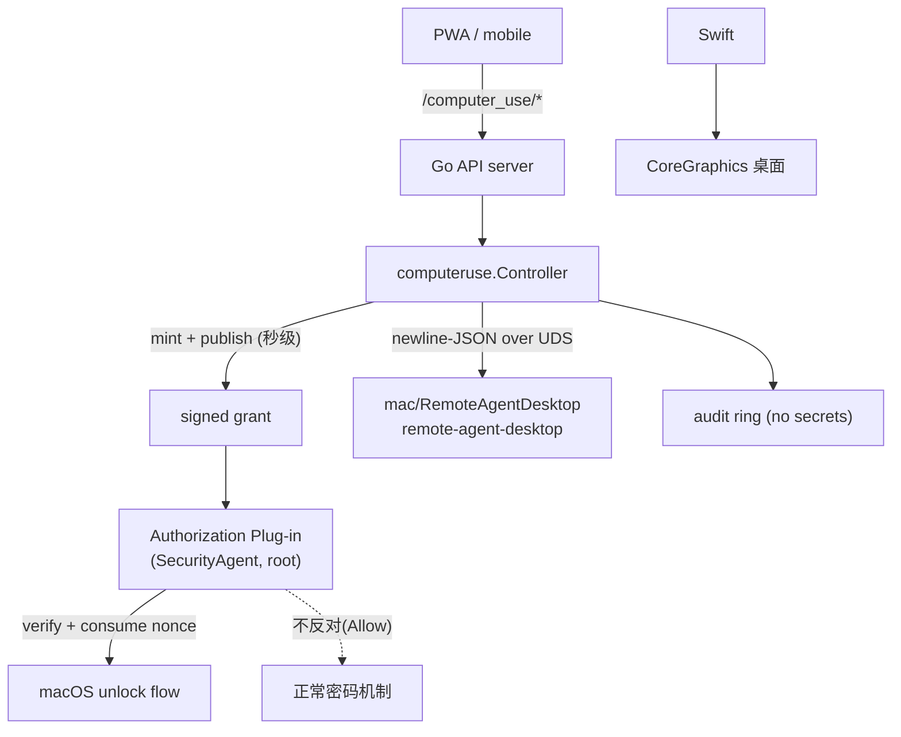
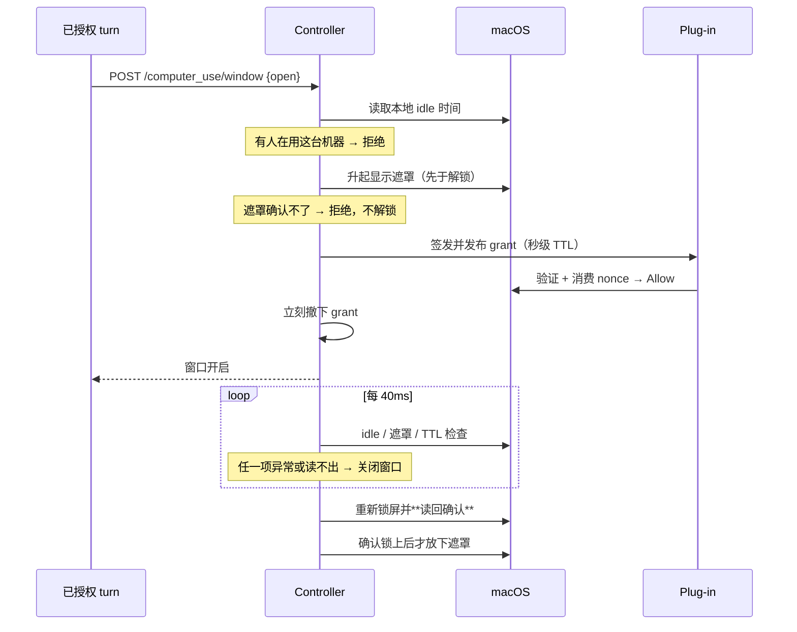

# Computer Use 与 Locked User

本文描述 `remote-agent` 的 computer-use 控制面，以及基于 **Apple Authorization
Plug-in** 的 **Locked Use**（锁屏后继续操作桌面）。

参考实现语义对齐 ChatGPT 的 locked use：安装一个参与 macOS unlock flow 的
authorization plug-in，在一次已授权的 computer-use turn 内允许临时解锁，并以
限时窗口、显示遮罩、本地输入即时重新锁屏作为约束。

> **两个功能都默认关闭。** `computer_use.enabled` 打开动作面；
> `computer_use.locked_use.enabled` 才打开解锁能力。两者都必须在设备本机的
> `config.json` 里显式开启——**任何网络请求都无法开启它们**。

## 结论先行

- Locked Use **不是通用远程解锁**。它只在一次已授权 turn 的解锁瞬间生效，
  不为其他应用或本地进程提供解锁路径。
- plug-in **从不接触密码**。它既不读取也不写入
  `kAuthorizationEnvironmentPassword`，只回答"这次解锁是否放行"。
- plug-in **永远不会把你锁在门外**：它从不返回 Deny，也从不返回 `undefined`。
  `undefined` 的语义是"该 mechanism 未做出决定"，authd 可能据此判定整个授权失败
  ——在解锁 right 上那意味着一台谁都解不开的 Mac。因此无 grant 时返回 Allow，
  含义仅是"本 mechanism 不反对"，后续的密码 mechanism 照常质询。
- grant 是**秒级、单次、签名**的凭据，在解锁前一刻签发、被该次解锁消费后立刻撤下。
  磁盘上长期存在的 grant 就是环境权限，正是本功能必须避免的东西。
- 控制器的核心不变量是 **不确定即重新锁屏**。任何 safeguard 读不出结果都按失败
  处理，没有"记录日志然后继续"的分支。

## 总体拓扑



`remote-agent` 持有 ECDSA P-256 **私钥**；plug-in 只被 provision 对应的**公钥**。
私钥永远不离开 agent 进程，公钥永远不足以签发 grant。

选 P-256 而不是 Ed25519，是被验证方一侧逼出来的，不是偏好：plug-in 只能走
Security.framework 验签，而 SecKey 的 Ed25519 常量（`kSecAttrKeyTypeEd25519`、
`kSecKeyAlgorithmEdDSASignatureMessage…`）是 **SPI** —— 只由 `Security.tbd`
导出，任何公开头文件里都没有声明。mechanism bundle 一旦绑定私有符号，Apple
哪天撤掉它，bundle 就会在 **authd 内部、screensaver-unlock right 上**加载失败，
那正是设计承诺 1 要避免的锁死方向。`kSecKeyAlgorithmECDSASignatureMessageX962SHA256`
是公开 API，Go 的 `ecdsa.SignASN1` 产出的正是它要的 X9.62 DER。

`mac/preflight.sh` 会在目标 Mac 上做两件 CI 做不到的事：拒绝 plug-in 引用任何
未在公开头文件中声明的 `kSec*` 常量，以及用 Go 真实签出的 grant 跑一遍 plug-in
自己的验签函数（并确认换一把公钥会被拒）。两侧各自自洽却互不接受是静默失败——
agent 一直签，plug-in 一直拒，唯一症状是"这台 Mac 就是解不开锁"。

## Grant 契约

grant 的权威定义在 `internal/computeruse/grant.go`；plug-in
(`mac/authorization-plugin/RemoteAgentLockedUse.m`) 是**执行副本**，Go 侧的
`VerifyGrant` 是可在 CI 里测试的镜像实现，不是替代品。

签名载荷（字段与顺序属于 wire contract，改动必须 bump `GrantVersion`）：

| 字段 | 含义 |
|---|---|
| `v` | grant 版本；verifier 不认识就拒绝 |
| `purpose` | 固定 `screensaver-unlock`；grant 不是通用授权令牌 |
| `nonce` | 16 字节随机数，hex 编码；verifier ledger 里的单次使用键 |
| `device_id` | 绑定设备；跨设备重放无效 |
| `turn_id` | 归属的 turn，仅用于审计关联 |
| `issued_at` / `expires_at` | 签发/过期时间 |

载荷里**没有**、也不允许出现任何可以充当凭据的字段
（`TestGrantPayloadCarriesNoCredentialFields` 会盯住这一点）。

### verifier 的检查顺序

1. **签名先行**——先验签，再解析被签名覆盖的那份字节。不解析未被签名的结构。
2. 版本、`purpose`、`device_id`、nonce 格式。
3. **新鲜度由 verifier 决定，不信任 grant 自述**：
   `expires_at - issued_at > 15s` 直接**拒绝**（不是截断后接受），
   `issued_at` 超前于当前时间（允许 5s 偏移）拒绝，已过期拒绝。
   这样一个被泄漏或误签的 grant 不可能变成长期万能钥匙。
4. **最后原子消费 nonce**：以 `O_CREAT|O_EXCL` 写入 root-owned ledger。
   `EEXIST` 即重放，拒绝；写入失败也拒绝——**没有任何路径让一个 grant 被用两次**。

全部通过才算一次"已授权解锁"并消费 nonce。**但无论结果如何，mechanism 都返回
`kAuthorizationResultAllow`**——见下面的"未验证事项"。

## Locked Use 窗口生命周期



### 各项 safeguard

| Safeguard | 行为 | 失败时 |
|---|---|---|
| 本地输入 | 开窗前要求已 idle；窗口内固定 **40ms** 轮询 | 有输入 → 立即关窗重新锁屏 |
| 显示遮罩 | 覆盖全部活动显示器，**先于解锁**升起 | 无法确认 → 拒绝开窗 |
| 窗口硬 TTL | 与 turn 活跃度无关的上限（默认 300s） | 到期 → 关窗重新锁屏 |
| grant TTL | 默认 10s，上限 15s，解锁后立刻撤下 | 过期 → 解锁失败 |
| 重新锁屏 | 命令后**读回确认**，有界重试 | 确认不了 → **保持遮罩** 并审计告警 |
| 启动清扫 | arm 前删除全部 grant 并强制锁屏 | 无法建立锁定基线 → 拒绝 arm |
| 截屏闸门 | 窗口开启且遮罩未确认时拒绝 `/screenshot`、`/ocr` | 拒绝，不落盘 |

轮询间隔**不可配置**，避免部署把它放宽到秒级从而给现场的人留出操作时间。

### 为什么这个顺序

清理顺序是 **先确认锁屏 → 再放下遮罩 → 最后撤 grant**（撤 grant 实际最先做，
因为它只会阻止新的解锁）。如果在确认锁屏之前放下遮罩，就会出现最糟糕的状态：
桌面是活的、没有遮挡，而 agent 以为自己已经清理完毕。因此**重新锁屏失败时遮罩
保持升起**，并记入审计。

## 配置

```json
"computer_use": {
  "enabled": false,
  "locked_use": {
    "enabled": false,
    "grant_ttl_seconds": 10,
    "window_ttl_seconds": 300,
    "input_relock_grace_ms": 250,
    "require_display_shield": true
  }
}
```

所有数值都会被 clamp（`grant_ttl` [2,15]、`window_ttl` [15,900]、
`input_relock_grace_ms` [100,5000]），且 `grant_ttl` 不会超过 `window_ttl`。
`0`/缺省取默认值，越界值收紧到边界——配置只能收窄窗口，不能放宽。

运行时开关 `POST /computer_use/locked_use {"active":bool}` 只能在配置允许的
范围内移动：可以关，但**不能在配置没开的设备上打开**。

## API

| Method | Path | 用途 |
|---|---|---|
| GET | `/computer_use` | 能力、arm 状态、窗口状态、审计环（不含任何 secret） |
| POST | `/computer_use/locked_use` | `{active}` 运行时开关，配置为上限 |
| POST | `/computer_use/window` | `{turn_id, action:"open"\|"close"}` |
| POST | `/computer_use/action` | 封闭动作集：`screen.capture`、`pointer.move/click/scroll`、`keyboard.type/key` |

动作集是**封闭**的：未知 id 在 API 边界被拒绝，不会传给 native helper，也不经过
shell。所有坐标、文本长度、组合键数量、点击次数、滚动幅度都有上界。

`/computer_use/window` 的 open 会等待 macOS 真正完成解锁，上界是 grant 自身的
秒级 TTL。失败路径上耗时最长的"确认重新锁屏"被移到后台执行（窗口占位保留到清理
完成，因此重试不会开出第二个窗口），所以 HTTP 响应不会被 20s 的重锁重试拖过
relay 的 30s 超时。控制器**不使用请求的 context**：客户端断开或 relay 截断都不会
丢下一个半开的窗口。

## 安装

### 0. 先跑 preflight

Swift helper 与 ObjC plug-in 只能在 macOS 上编译和运行，而 grant 契约的两侧
（helper 签发 / plug-in 验签）也只有在这里才能被拿来互相跑一遍。CI 与 Linux
容器都做不到这些。**在装任何东西之前**，先在目标机器上跑一次：

```bash
cd /path/to/remote-agent && bash mac/preflight.sh
```

默认**只读**：不锁屏、不升遮罩、不安装 plug-in、不改 authorization database。
它检查工具链、Go 构建/vet/测试、helper 能否构建并通过自己的测试（护栏、词表、
grant 契约都在那里）、三个只读探针能否回答、helper 里确实没有 unlock 操作、
Accessibility 是否授权、plug-in 能否编译，以及三件跨语言的事：

* **常量是否漂移**（`version`、`maxTTL`、`maxClockSkew`、公钥长度、grant 目录）
  ——漂移会让 helper 签发的 grant 永远被 plug-in 拒绝，唯一症状是"就是解不开锁"。
* **plug-in 是否只用公开 Security API**——它引用的每个 `kSec*` 常量都必须在公开
  头文件里有声明。绑定私有符号的 mechanism 会在 authd 内部加载失败，那是锁死方向。
* **helper 真实签出的 grant，能否被 plug-in 自己的验签函数接受**，并且换一把
  公钥必须被拒绝（否则一个"永远放行"的验证器也能通过检查）。

两个会打断桌面的检查需要显式开启：`--check-shield`（短暂遮挡屏幕）、
`--check-lock`（锁屏）。它们是二进制的一次性命令行开关，**不是 socket 操作**：
一个任何已连接进程都能释放的遮罩，等于可以在窗口开着时被掀掉。

### 1. 安装桌面 helper

桌面能力与全部 Locked Use 护栏都在常驻进程 `remote-agent-desktop` 里。它随 agent
二进制一起分发（release 仍然只有一个产物、一个 sha256、一套签名），安装时落盘：

```bash
remote-agent desktop install                       # 写出 helper，打印路径
mac/launchagent/install.sh --config /path/config.json   # 以登录用户身份运行
```

必须是**用户会话里的 LaunchAgent**，两条理由不可互换：遮罩是真实窗口，
需要 Aqua 会话；而 TCC 把 Accessibility / Screen Recording 归属到*责任进程*，
由 agent 派生的子进程会把授权记到 agent 头上，合成事件于是静默失效——看起来像
功能坏了，而不是缺权限。

装好后要在「系统设置 > 隐私与安全性」里给 **helper 二进制本身**授予
Accessibility 与 Screen Recording。

`deploy/install.sh` 会在首次安装时自动做完这两步。后续的 relay 自动更新只替换
agent 二进制，agent 启动时会把内嵌的 helper 写出并在内容变化时 `launchctl
kickstart -k` 重启它——否则更新会落盘但不生效：launchd 仍在跑旧进程。

### 2. 构建并安装 plug-in

plug-in 必须在目标 Mac 上编译和签名（它会被加载进 SecurityAgent 进程），CI 不构建它。

```bash
cd remote-agent/mac/authorization-plugin
RA_PLUGIN_SIGN_IDENTITY="Developer ID Application: ..." ./build.sh
sudo ./install.sh                     # 安装 bundle，注册 mechanism
```

安装后读取公钥并 provision。签名私钥由 helper 持有（`P256`，base64 PKCS#8，0600），
公钥经 agent 的状态接口发布——它只能验签、不能签发，所以公开它不授予任何东西：

```bash
curl --unix-socket <agent.sock> http://localhost/computer_use   # locked_use.public_key
sudo install -o root -g wheel -m 0600 <key-file> \
  "/Library/Application Support/remote-agent/locked-use/public.key"
```

然后在 `config.json` 打开两个开关，重启 `remote-agent` 与 helper。

一台已经跑过旧版本（Go 侧签发 grant）的设备**不需要重新 provision 公钥**：
helper 能读同一份 PKCS#8 私钥并导出完全相同的公钥，这条由测试里的金标向量钉住。

### 部署注意

grant 目录默认就是 plug-in 编译期常量
`/Library/Application Support/remote-agent/locked-use`。若改成别处，plug-in 将
读不到 grant——Locked Use 会显示 armed 却永远解不开锁。

桌面能力与全部 Locked Use 护栏都在常驻 helper `remote-agent-desktop` 里，
agent 只通过 UDS 转发。helper 自己读设备的 config.json——**配置永远不经 socket
下发**：Locked Use 让机器能自解锁，这个能力必须在设备上授予，否则任何能连上
socket 的本地进程都能把它打开。helper 未运行时 `/computer_use` 如实报告
`available:false` 并对操作返回 503，功能保持关闭而不是半开。

完全回退：

```bash
sudo ./uninstall.sh    # 先摘 mechanism，再删 bundle 与信任状态
```

`uninstall.sh` 优先直接还原安装前备份的原始 right；备份不可用时才退回"先摘
mechanism、再删 bundle"的顺序——顺序不能反，指向缺失 mechanism 的 right 是这个
功能唯一可能让 Mac 变得**更难**解锁的情况。

## 未验证事项(务必先读)

**安装本 plug-in 单独并不会绕过密码。** mechanism 只会"不反对"，因此一次有效
grant 能否真正缩短解锁流程，取决于该 right 的 mechanism 列表在你这个 macOS
版本上的排布方式。这一点**无法在 CI 或非 macOS 环境验证**，必须在目标机器上确认：

1. 先在**备用 Mac 或同版本虚拟机**上安装，保留第二个管理员账户或 Recovery 入口。
2. 安装后**先确认仍能正常手动解锁**。
3. 再确认一次 Locked Use turn 是否真的解锁。
4. 如果没有解锁：功能**失败关闭**（不解锁），不会造成锁死；调整 right 的
   mechanism 排布后重试。

`install.sh` 因此要求显式 `RA_LOCKED_USE_ACK=1`，并在改动前把原始 right 备份到
`$STATE_DIR/system.login.screensaver.original.plist`；`uninstall.sh` 优先直接
还原该备份。

## 威胁模型与已知边界

诚实地说明这一版**不覆盖**什么，比声称覆盖更重要：

1. **签名私钥是文件（0600），不是 Secure Enclave。**
   文件权限挡得住其他用户，挡不住**已经以该用户身份运行的进程**。能读到该文件的
   本地恶意进程可以签发 grant。要抵御同用户攻击者，需要把私钥换成 Secure Enclave
   中不可导出的 P-256 密钥，并把 ACL 绑定到 agent 的代码签名。
   **这是本功能最重要的待办硬化项**，在此之前不要把 Locked Use 部署到会遭遇
   同用户攻击者的设备上。

2. **没有 root deadman 进程。** 输入监控、TTL 与重新锁屏都在 agent 进程内。
   `kill -9` 或 `SIGSTOP` 会同时冻结它们：grant 过期能阻止**新的**解锁，但不会把
   **已经解锁**的屏幕重新锁上。健壮的做法是由 root 监督的独立进程在 agent 心跳
   失效时强制锁屏。当前实现依赖 supervisor 尽快重启 agent，而 agent 启动时的
   清扫会强制锁屏。

3. **grant 目录是 root-owned，但 agent 需要写入。** 安装脚本把目录设为 root 拥有；
   更强的做法是 agent 通过 XPC/UDS 把 grant 交给 root helper（以 peer audit-token
   与代码签名鉴权），由 helper 落盘，从而让 plug-in 完全不读取用户可写路径。
   plug-in 侧已经做了 `O_NOFOLLOW` + `fstat` + uid/类型/大小校验作为纵深防御。

4. **审计环在内存中，并会出现在 `/computer_use` 响应里。** 它只记录事件、时间、
   turn id、nonce 前 8 字符与原因，不含 grant 正文或密钥材料。注意
   `remote-agent.log` 会被上传到 relay——任何新增日志都必须遵守同样的约束。

5. **遮罩由一个 helper 进程持有。** 显示器热插拔会让它退出，从而使下一次覆盖检查
   失败并触发重新锁屏（安全方向）。`Engaged()` 每次都向 helper 实时探测覆盖状态
   并比较活动显示器数量，不使用缓存标志——否则"遮罩掉了"这条 safeguard 会是死代码。

6. **本地输入判定排除了 agent 自己的合成事件。** `hidSystemState` 的 idle 计数
   包含本进程 post 的事件，直接使用会让 agent 一打字就把自己锁掉，而且无法区分
   真人与 agent。helper 因此记录自己最后一次 post 的时间戳，只有无法归因于 agent
   的输入才算"有人在场"。这个归因基于时间戳而非事件来源标记，存在 ~0.35s 的判定
   窗口。

7. **锁屏使用 `SACLockScreenImmediate`（login.framework 私有符号）**，而不是
   `pmset displaysleepnow`——后者只让显示器睡眠，是否真正锁屏取决于用户的
   "睡眠后要求密码"设置及其宽限期。私有符号在未来 macOS 版本上可能变化；调用失败
   会表现为"重新锁屏无法确认"，从而保持遮罩并告警（安全方向）。

## 必须保持的不变量

1. 任何代码路径都不得读取、请求或记录用户密码。
2. plug-in 没有有效 grant 时必须返回 `undefined`，永远不返回 deny。
3. grant 只在解锁前一刻签发，解锁结束立刻撤下；不得在窗口期间常驻磁盘。
4. nonce 消费必须是 `O_EXCL` 原子操作，且发生在返回 Allow **之前**。
5. verifier 自行决定新鲜度上限，不接受 grant 自述的更长寿命。
6. safeguard 读不出结果 = 失败 = 关窗重新锁屏，不允许"记录后继续"。
7. 重新锁屏必须读回确认；确认不了就保持遮罩，不得放下。
8. 配置是能力上限；网络请求只能在其之下收窄，不能开启。
9. native helper 不得提供任何 unlock 操作——解锁只属于 macOS 与 plug-in。

## 代码导航

| 主题 | 文件 |
|---|---|
| grant 签发/校验/单次消费 | `internal/computeruse/grant.go` |
| 窗口状态机、safeguard、审计 | `internal/computeruse/locked.go` |
| 封闭动作集与校验 | `internal/computeruse/action.go` |
| agent 侧转发客户端 | `internal/computeruse/client.go` |
| 桌面 helper（护栏与 grant 的实现处） | `mac/RemoteAgentDesktop/Sources/` |
| API 路由与截屏闸门 | `internal/api/computeruse.go` |
| Authorization Plug-in（执行副本） | `mac/authorization-plugin/RemoteAgentLockedUse.m` |
| 构建/安装/卸载 | `mac/authorization-plugin/*.sh` |
| CoreGraphics 与遮罩 | `mac/RemoteAgentDesktop/Sources/RemoteAgentDesktopCore/Desktop.swift` |
