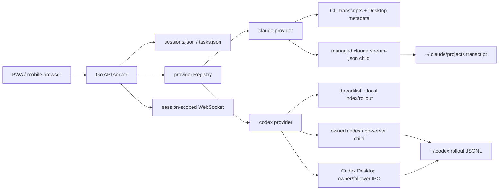

# Provider 架构

本文描述 `remote-coding` 当前生产 Go 路径中的 provider 架构。范围包括
provider 注册、会话身份、原生会话发现、发送路由、stream/status 和审批。旧的
Python provider、Claude Desktop wrapper/broker 和 tmux backend 已从仓库删除。

## 结论先行

- 生产 registry 对外只有两个完整 provider：`claude` 和 `codex`。
- `claude_cli`、`claude_desktop` 是旧数据和旧客户端的兼容别名，API 会把它们
  归一化为 `claude`；它们不是独立 provider，也不拥有独立会话命名空间。
- Claude Desktop 和 CLI 的发现数据按同一个 Claude transcript UUID 合并，但
  当前所有写操作都由 remote-coding 管理的 standalone Claude CLI
  `stream-json` 进程完成。
- Codex 只有一个 provider id，但内部有两条明确的 delivery route：
  remote-coding 自己的 headless `codex app-server`，以及 Codex Desktop
  owner/follower IPC。路由属于 logical session，不能在一次发送失败后静默切换。
- 所有可变状态和控制操作必须至少按 `(provider_id, session_id)` 作用域化；涉及
  native runtime 时再通过持久化映射找到 `transcript_id` / `native_session_id`。

## 总体拓扑



`cmd/remote-coding/main.go` 只负责加载 config/state、调用
`provider.BuildRegistry`、创建 API server，并把 provider 的 stream publisher 接到
按 session 分组的 WebSocket fan-out。provider 不直接处理 HTTP，也不保存 PWA
tab 状态。

## Registry 与 provider contract

`internal/provider/provider.go` 的 `BuildRegistry` 执行以下规则：

1. 配置中的 `claude`、`claude_cli`、`claude_desktop` 不逐个注册。
2. 优先读取旧的 `claude_cli` 配置，否则读取 `claude` 配置，最终只注册
   `reg["claude"] = NewClaudeCLI(...)`。
3. `codex` 注册为 Go `NewCodex(...)`；未配置时也会补一个默认实例。
4. 其他自定义 id 不注册；当前 registry contract 明确只支持 Claude 和 Codex。
5. provider 展示顺序固定为 `codex`、`claude`。

API 层的 `canonicalProviderID` 把旧 id `claude_cli` / `claude_desktop` 映射到
`claude`。兼容只发生在边界层；新配置、新 session record 和新前端状态都应写
canonical id。

Go `Provider` 接口要求实现：

- 身份与展示：`ID`、`Status`、`ModelSelect`
- 原生数据读侧：`ListNativeSessions`、`SessionMessages`、`SessionModel`、
  `ReferencedFiles`
- logical session 生命周期：`OpenOrCreateSession`、`CloseSession`
- turn 控制：`SendPrompt`、`LatestOutput`、`DetectState`、`RelayApproval`、
  `SendKeys`、`Interrupt`、`SetSessionModel`

能力较强的 provider 再通过小接口按需扩展，而不是继续扩大主接口：

| 可选能力 | 接口/方法 | 当前用途 |
|---|---|---|
| 安装检测 | `InstallChecker` | `/providers` 默认隐藏本机未安装的 provider |
| 附件发送 | `AttachmentSender` | 把已在 HTTP 边界校验和落盘的附件交给 provider |
| transcript asset | `SessionAssetReader` | 只读取当前会话 transcript 已引用的图片 |
| runtime 会话 | `RuntimeSessions()` | `/live_sessions` 合并真实运行态 |
| native attach | `OpenResumeSession(...)` | 激活、resume 或 fork 原生会话 |
| logical/native 绑定 | `BindTranscript(...)`、`BindDesktopTranscript(...)` | 重建 logical id 到 transcript/thread 的内存映射和 Codex route |
| 精确运行态 | `SessionRunning(...)`、`SessionSettings(...)` | 避免 provider-global 状态污染其他 tab |
| 人机交互 | `ApprovalRequest(...)`、`RelayApprovalRequest(...)`、`AnswerQuestion(...)` | request-scoped approval / question |
| 消息回退重发 | `UserMessageRewinder` | Codex thread rollback 后创建新 logical session |
| 实时事件 | `SetStreamPublisher(...)` | provider event 转到 session-scoped WebSocket |

## 会话身份与数据层

一个用户可见会话同时存在三类 id。它们不能混用：

| 字段 | 所有者 | 作用 |
|---|---|---|
| `device_id` | 部署实例 | Mac/账号隔离边界 |
| `provider_id` | registry | canonical provider：`claude` 或 `codex` |
| `session_id` | remote-coding | PWA/API 使用的 logical session id，也是任务、附件和控制操作的主键 |
| `native_session_id` | provider runtime | Claude transcript UUID 或 Codex thread UUID；表示可激活的 native handle |
| `transcript_id` | durable read side | transcript/rollout 的合并键；通常与 native id 相同，但语义上是持久读侧 |
| `origin` | discovery | `cli` / `desktop` / `both` 等元数据，只说明从哪里发现，不决定发送路由 |
| `source` | runtime/read side | `claude_cli_stream`、`claude_turnstate`、Codex local/app-server 等观测来源，不决定 owner |
| `delivery_route` | persisted logical session | 当前只对 Codex Desktop-native 会话显式写 `desktop_ipc`；普通缺省 record 表示 remote-coding-owned app-server，旧 `r0...` / `r-codex-...` logical id 仍有 Desktop-route 兼容识别 |

`sessions.json` 保存 logical record，核心映射是：

```text
(device_id, provider_id, session_id)
                  -> native_session_id / transcript_id
                  -> cwd / model / effort / mode / state / last_error
```

当前 `state.Store` 文件更新仍以全局 `session_id` 替换 record，因此新建/激活流程必须
生成全局不冲突的 logical id。native attach 使用
`r-<provider>-<sha256(provider + native id) 前 12 hex>`；fork 和新会话使用随机 id。
API 查找和所有 mutating control 仍必须带 provider scope，并在调用 provider 前执行
`hydrateControlSession`，从持久 record 或 runtime row 恢复 logical → native 映射。

### 三个会话视图

| 视图 | API | 数据含义 |
|---|---|---|
| Native discovery | `/native_sessions?provider_id=...` | provider 原生存储中的历史会话，可只读预览，尚不一定有 logical record |
| Stored logical sessions | `/sessions` | remote-coding 已创建/激活、可承载任务和附件的 record |
| Runtime/live sessions | `/live_sessions` | provider runtime、stored record 和可选 native row 的合并结果 |

`/live_sessions` 以 `(provider_id, transcript_id)` 去重：runtime 的 live/state/source
优先，stored record 的 logical `session_id`、title、cwd 等用户状态优先。这样重启后
即使 provider 内存映射丢失，仍能把运行中的 native owner 归回原 logical session。

`active_provider` / `active_session_id` 只表示该 agent 当前 UI 默认选择，不是 owner
或授权边界。多 tab 和多设备请求应始终显式传 `provider_id`、`session_id`。

## 通用请求路径

### 读路径

1. `/providers` 从 registry 读取安装状态、capabilities 和 model selector。
2. `/native_sessions` 调 provider discovery，并使用短时 cache 避免昂贵扫描阻塞请求。
3. `/session_preview` 先恢复 logical/native 绑定，再从 provider 的 durable read side
   读取规范化消息。
4. `/status?provider_id=&session_id=` 以 pending request 和 session-running 结果覆盖
   provider-global last state。
5. `/stream?provider_id=&session_id=` 只订阅该 provider/session 的事件 key。

### 写路径

1. `/sessions` 创建 logical record，并调用 `OpenOrCreateSession` 建立 native session。
2. `/resume_native_session` 验证 native row 后调用 provider 的 `OpenResumeSession`，
   再持久化 logical/native 映射；fork 会生成新的 logical id。
3. `/send_prompt` 先按 provider scope 找 session、恢复绑定、校验附件，然后把 record
   标为 `delivering` 并异步调用 provider。只有 provider 返回 native turn/task id 后
   才进入 `running`，避免 Desktop 尚未收到输入时 UI 提前显示 Stop/Steer。
4. `/interrupt`、`/steer`、`/approval`、`/question_answer` 都先执行同样的 session
   hydration；不得直接把一个未知 id 当作 transcript/thread id。

## Claude provider

### 当前边界

生产实例是 `NewClaudeCLI("claude", ...)`，backend 为
`claude_stream_json_go`：

- 每个 logical session 对应一个受管的 standalone `claude`
  child 和一组双向 NDJSON pipe。
- 新 transcript 使用 `--session-id`，恢复使用 `--resume`，fork 加
  `--fork-session`。
- prompt 以完整 SDK `user` frame 写 stdin；assistant/tool/control 事件从 stdout
  进入 WebSocket 和 session buffer。
- interrupt、approval、`AskUserQuestion` 都使用 request-scoped
  `control_request` / `control_response`，不模拟终端按键。

Claude provider 不再有 wrapper、broker、tmux 或 raw-key fallback。旧部署上的
watcher drop-in、enable marker 和 wrapper binaries 由 installer/updater 一次性清理；
Desktop 只贡献 metadata，mutating control 始终进入 standalone stream-json child。

### Discovery 与 owner handoff

Claude discovery 同时读取：

- `~/.claude/projects` 的 CLI transcript；
- `~/Library/Application Support/Claude/claude-code-sessions` 的 Desktop metadata。

两侧按 `cliSessionId` / transcript UUID 合并。Desktop title、cwd、时间等用于丰富
同一行，`origin` 记录 `cli`、`desktop` 或 `both`。

当用户激活 Desktop-origin transcript 时，provider 不向 Desktop IPC 发送 prompt。
它先用 Desktop session alias 和已打开 transcript 精确定位内部 Claude CLI 进程，
仅终止该 session 的进程族并确认退出，再启动自己的 `claude --resume` child。
无法检查 owner、无法确认退出或其他 owner 仍处于 running 时，操作失败；不能创建
第二个 transcript writer。

### Read、state 与审批

- 历史/重启恢复：以 Claude transcript 为 durable read side。
- 当前输出：优先使用 managed stream buffer；进程结束后仍可由 transcript 预览。
- runtime state：managed stream 是主来源，turn-state hook 是外部 owner/running
  检测和接管保护；Desktop metadata 本身不代表 live owner。
- live permission/question：保存在 session + request id 作用域内，可以从 PWA 回答。
- transcript 中遗留但原 stdio callback 已消失的问题可以展示，但必须标记为不可操作，
  不能把答案发给一个新 owner 冒充旧 callback。

## Codex provider

### Discovery 与 read side

生产实例是 `NewCodex("codex", ...)`，backend 为 `codex_app_server_go`。
默认优先使用 Codex.app 内置 binary，然后才是 `$PATH`。

- `/native_sessions` 以 app-server `thread/list` 为主，再按 thread UUID 合并本地
  `~/.codex` index 和 rollout JSONL；app-server 不可用时仍返回本地结果。
- `/session_preview` 先读本地 rollout，避免轮询请求被 app-server resume 卡住；仅当
  rollout 尚未落盘时才做最多 2 秒的 `thread/resume` fallback。
- headless app-server notification 会发布到 logical `session_id` 和 native thread id。
- Desktop-owned turn 的正文由 PWA 定时 live-tail `/session_preview`；Desktop follower
  bridge 负责 owner、running、settings 和 pending human request，不伪造正文 delta。

### 两条 delivery route

| 会话来源 | route | 建立方式 | 发送/steer/interrupt owner |
|---|---|---|---|
| PWA 新建 | app-server（record 中 `delivery_route` 缺省） | `thread/start` | remote-coding 自己的 app-server child |
| Codex native preview 直接发送 | `desktop_ipc` | 先持久化 deterministic logical id；不预先 `thread/resume` | 懒加载 `codex://threads/<id>` 后的 Desktop owner client |
| 显式 resume/fork 兼容路径 | provider `OpenResumeSession` | `thread/resume` 或 `thread/fork`，标记 Desktop-sync candidate 并尝试 attach owner | attach 成功后的 Desktop owner；fork 得到新 thread |

Codex Desktop thread 和 app-server thread 都是 UUID，不能靠 id 格式判断 owner。
`BindDesktopTranscript` 和持久化 `delivery_route=desktop_ipc` 用来区分 native Desktop
delivery；普通 `BindTranscript` 必须保留 app-server ownership。

Desktop route 的发送规则是：

1. 找到持久化 thread id 和缓存的 Desktop `owner_client_id`。
2. owner 未加载时通过 `codex://threads/<id>` 打开 thread，并在 bounded timeout 内
   等 renderer 声明 owner。
3. 对该 owner 定向发送 start/steer/interrupt；`no-client-found` 只允许刷新 owner
   并重试一次。
4. owner 缺失、attach 超时或 IPC 结果不确定时返回错误，不能 fallback 到另一个
   app-server owner。这样调用方能明确知道 prompt 没有被安全确认投递。

只有从一开始就由 remote-coding 创建并拥有的 headless session 才走 app-server
`turn/start`、`turn/steer`、`turn/interrupt`。这里的“两条 route”是 session ownership
模型，不是每次请求的主备切换模型。

### Desktop follower 与审批

持久 follower bridge 监听 Desktop owner 的
`thread-stream-state-changed` snapshot/immer patch，按 thread 保存：

- owner client id、revision 和 running state；
- `approvalPolicy`、`approvalsReviewer`、sandbox、model、effort；
- 原始 pending server requests 和 JSON-RPC request id。

`/status` 把最老的 pending request 暴露为 `approval_request`，并保留稳定
`request_id`。web 的决定通过 follower command 定向回原 owner；Desktop 或 web
先回答后，另一侧晚到的结果返回 `stale`。`auto_review` 已由 guardian 处理的请求
不会伪装成人工审批。

headless route 的审批直接回复 remote-coding 自己 app-server child 的 JSON-RPC
request。两条 route 最终都以 `(thread_id, request_id)` 跟踪，某个 thread idle 不得
清空其他 thread 的 pending queue。

## 必须保持的架构不变量

1. 新代码只写 canonical provider id：`claude` / `codex`。
2. `origin`、`source` 是观测元数据，不能代替持久化 ownership / delivery route。
3. 每次 status、stream、approval、question、interrupt、steer 都按 provider + logical
   session 取数，不读取另一个 tab 的 provider-global last state。
4. native preview 可以只读且暂不持久化；第一次 mutating send 前必须建立 logical
   record 和 logical/native binding。
5. Claude resume 前只有一个 transcript writer；Codex Desktop-native 发送只有一个
   owner client。无法证明安全交接时宁可失败，也不创建第二 owner。
6. request id 是审批和问题的必要组成部分；“当前 provider 的最新审批”只可作为
   兼容 fallback，不能成为新调用方式。
7. provider 的 durable read side 与 live control side 可以不同，但必须通过同一个
   transcript/thread id 汇合，并在重启后可由 stored record 恢复。

## 代码导航

| 主题 | 文件 |
|---|---|
| registry、主接口、optional interfaces | `internal/provider/provider.go` |
| provider id 兼容、logical/native hydration | `internal/api/helpers.go` |
| session、send、resume、live merge、WebSocket | `internal/api/server.go` |
| pending approval 聚合 | `internal/api/approvals.go` |
| Claude discovery、handoff、控制 | `internal/provider/claude.go`、`internal/provider/claude_process.go`、`internal/provider/claude_stream.go` |
| Codex discovery、route、app-server | `internal/provider/codex.go`、`internal/provider/codex_app_server.go` |
| Codex Desktop owner/follower | `internal/provider/codex_desktop_ipc.go`、`internal/provider/codex_desktop_bridge.go` |
| transcript/rollout normalization | `internal/provider/native.go` |
| logical session 持久化 | `internal/state/store.go` |
