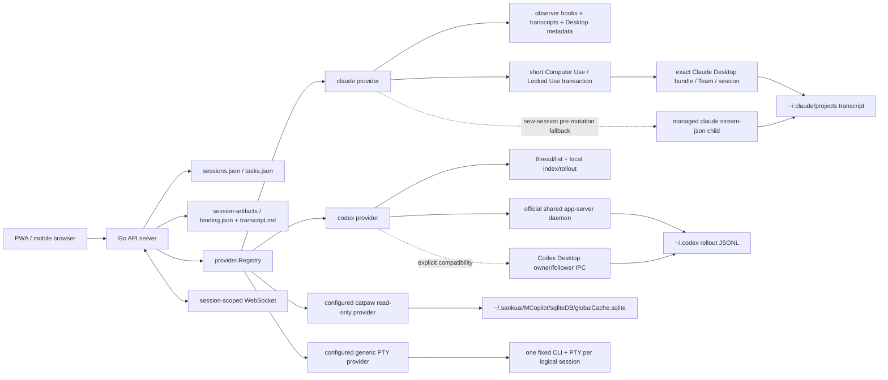

# Provider 架构

本文描述 AgentHalo 当前生产 Go 路径中的 provider 架构，以及多产品接入的分阶段
边界。范围包括 provider 注册、会话身份、原生会话发现、发送路由、stream/status、
审批、每会话派生文档，以及 Desktop provider 的进程内 Computer Use / Locked Use
控制。旧的 Python provider、Claude Desktop wrapper 和 tmux backend 已从仓库删除。

## 结论先行

- 生产 registry 始终提供内置 `claude` 和 `codex`，并可从配置注册能力受限的
  CatPaw read side 与 generic PTY provider。每个 canonical provider 都拥有独立的
  provider id 和会话命名空间。
- ChatGPT 与 Codex 是同一个 `codex` app-server owner 的两个产品 surface；
  `chatgpt` 只在 API 边界归一化为 `codex`，不能注册第二个 provider 或复制 thread。
- `claude_cli`、`claude_desktop` 是旧数据和旧客户端的兼容别名，API 会把它们
  归一化为 `claude`；它们不是独立 provider，也不拥有独立会话命名空间。
- Claude Desktop 和 CLI 的发现数据按同一个 Claude transcript UUID 合并。新
  logical session 默认绑定 session-sticky `desktop_computer_use`；prompt、
  `AskUserQuestion` 和一次性工具 allow/deny 通过短时进程内 Computer Use /
  Locked Use transaction 完成。
- `stream_json_cli` 只是在全新 session 的 capability preflight 于任何 UI mutation
  之前失败时可选定的 fallback。已有 Desktop owner、安全拒绝、任何可能已发生的
  mutation 或未知投递结果都禁止 CLI 重发。
- Codex 只有一个 provider id，但内部有两条明确的 delivery route：
  AgentHalo 自己的 headless `codex app-server`，以及 Codex Desktop
  owner/follower IPC。路由属于 logical session，不能在一次发送失败后静默切换。
- 所有可变状态和控制操作必须至少按 `(provider_id, session_id)` 作用域化；涉及
  native runtime 时再通过持久化映射找到 `transcript_id` / `native_session_id`。
- 当前 CatPaw 里程碑只开放本机会话发现与只读 preview。私有 REST、SQLite 写入、
  prompt/approval/question 的 UI mutation 均不在此阶段；后者必须先通过 exact app
  identity、exact native session、fresh AX 与 Locked Use terminal cleanup 的 PoC gate。

## 多产品接入矩阵

`provider_id` 是 mutable owner，不等于产品名称或 UI surface。API `/providers` 通过
typed profile 明确返回 `family`、`adapter_kind`、`runtime_namespace`、`surface`、
`aliases` 与 `routes`，客户端不得再从字符串前缀猜测 transport 或权限。

| 产品 surface | canonical provider | 当前 adapter | 当前写能力 |
|---|---|---|---|
| Codex / ChatGPT | `codex` | official Codex app-server；Desktop IPC 仅为同 owner 的显式 route | app-server contract 范围内 |
| Claude Desktop | `claude` | transcript observer + `desktop_computer_use` | 默认 route；每次动作一个短事务 |
| Claude CLI | `claude` | `stream_json_cli` | 仅 fresh session、任何 UI mutation 前的 fallback |
| CatPaw | `catpaw` | schema-detected local SQLite read side | 当前全部关闭 |
| DeepSeek | `deepseek`（规划） | transcript + Computer Use / Locked Use | 尚未注册；PoC 前全部关闭 |

一个 profile 可以有多个 surface/route，但只能有一个 `runtime_namespace` 和一个
canonical provider owner。alias 解析只发生在请求边界；state、task、WebSocket key、
artifact binding 和新的客户端持久状态都写 canonical id。

## 总体拓扑


```mermaid
flowchart LR
    PWA["PWA / mobile browser"] --> API["Go API server"]
    API --> Store["sessions.json / tasks.json"]
    API --> Artifacts["session-artifacts / binding.json + transcript.md"]
    API --> Registry["provider.Registry"]
    API <--> WS["session-scoped WebSocket"]

    Registry --> Claude["claude provider"]
    Claude --> ClaudeDiscovery["observer hooks + transcripts + Desktop metadata"]
    Claude --> ClaudeDesktop["short Computer Use / Locked Use transaction"]
    ClaudeDesktop --> ClaudeApp["exact Claude Desktop bundle / Team / session"]
    Claude -. "new-session pre-mutation fallback" .-> ClaudeCLI["managed claude stream-json child"]
    ClaudeApp --> ClaudeTranscript["~/.claude/projects transcript"]
    ClaudeCLI --> ClaudeTranscript

    Registry --> Codex["codex provider"]
    Codex --> CodexDiscovery["thread/list + local index/rollout"]
    Codex --> AppServer["official shared app-server daemon"]
    Codex -. explicit compatibility .-> DesktopIPC["Codex Desktop owner/follower IPC"]
    AppServer --> Rollout["~/.codex rollout JSONL"]
    DesktopIPC --> Rollout

    Registry --> CatPaw["configured catpaw read-only provider"]
    CatPaw --> CatPawDB["~/.sankuai/MCopilot/sqliteDB/globalCache.sqlite"]

    Registry --> GenericPTY["configured generic PTY provider"]
    GenericPTY --> PTYChild["one fixed CLI + PTY per logical session"]
```

`cmd/agenthalo/main.go` 只负责加载 config/state、调用
`provider.BuildRegistry`、创建 API server，并把 provider 的 stream publisher 接到
按 session 分组的 WebSocket fan-out。provider 不直接处理 HTTP，也不保存 PWA
tab 状态。

## Registry 与 provider contract

`internal/provider/provider.go` 的 `BuildRegistry` 执行以下规则：

1. `chatgpt`、`claude_cli`、`claude_desktop` 是 surface/兼容 alias，配置不能把
   它们注册成第二个 mutable owner。
2. 优先读取 canonical `claude` 配置；旧的 `claude_cli` 配置仅作为兼容输入，最终
   只注册 `reg["claude"]`。默认 primary/fallback 分别是
   `desktop_computer_use` / `stream_json_cli`，而不是两个 provider。
3. 配置存在 canonical `catpaw` 时注册专用只读 adapter；它不会落入 generic PTY。
4. 其他配置项声明 `"type": "pty"` 时，注册 generic PTY provider；只执行固定
   `command` + `args`，不经 shell，也不会继承 structured approval/steer 等能力。
5. `codex` 注册为 Go `NewCodex(...)`；未配置时也会补一个默认实例。
6. provider 展示顺序为 `codex`、`claude`、`deepseek`、`catpaw`，随后按 id 排列。

API 层的 `canonicalProviderID` 把 `chatgpt` 映射到 `codex`，把旧 id
`claude_cli` / `claude_desktop` 映射到 `claude`。兼容只发生在边界层；新配置、
新 session record 和新前端状态都应写 canonical id。

Go `Provider` 接口要求实现：

- 身份与展示：`ID`、`Status`、`ModelSelect`
- 原生数据读侧：`ListNativeSessions`、`SessionMessages`、`SessionModel`、
  `ReferencedFiles`
- logical session 生命周期：`OpenOrCreateSession`、`CloseSession`
- turn 控制：`SendPrompt`、`LatestOutput`、`DetectState`、`RelayApproval`、
  `SendKeys`、`Interrupt`、`SetSessionModel`

能力较强的 provider 再通过小接口按需扩展，而不是继续扩大主接口：

| 可选能力 | 接口/方法 | 当前用途 |
|---|---|---|
| 安装检测 | `InstallChecker` | `/providers` 默认隐藏本机未安装的 provider |
| 附件发送 | `AttachmentSender` | 把已在 HTTP 边界校验和落盘的附件交给 provider |
| transcript asset | `SessionAssetReader` | 只读取当前会话 transcript 已引用的图片 |
| runtime 会话 | `RuntimeSessions()` | `/live_sessions` 合并真实运行态 |
| native attach | `OpenResumeSession(...)` | 激活、resume 或 fork 原生会话 |
| logical/native 绑定 | `BindTranscript(...)`、`BindDesktopTranscript(...)` | 重建 logical id 到 transcript/thread 的内存映射和 Codex route |
| 精确运行态 | `SessionRunning(...)`、`SessionSettings(...)` | 避免 provider-global 状态污染其他 tab |
| 人机交互 | `ApprovalRequest(...)`、`RelayApprovalRequest(...)`、`AnswerQuestion(...)` | request-scoped approval / question |
| provider 桌面事务 | `ComputerUseAutomationHost` | 服务端固定 provider/session/op 身份并为 Claude 创建短时进程内 lease；无 HTTP open/action 回路 |
| 消息回退重发 | `UserMessageRewinder` | Codex thread rollback 后创建新 logical session |
| 实时事件 | `SetStreamPublisher(...)` | provider event 转到 session-scoped WebSocket |
| 显式 action policy | `ActionSupporter` | CatPaw 等只读 adapter 在 PWA 与 HTTP 服务端同时拒绝所有 mutation |

`/providers` 同时返回旧的 boolean `capabilities` 和闭集的 typed `actions`。每个
action 明确 `endpoint`、`scope`、`risk`、`supported`；PWA 的 steer/interrupt 等
控件优先按 typed action 渲染。这样 generic PTY 不会因为实现了基础接口，就被误认
为支持审批、问题、附件或 model 操作。

## 会话身份与数据层

一个用户可见会话同时存在三类 id。它们不能混用：

| 字段 | 所有者 | 作用 |
|---|---|---|
| `device_id` | 部署实例 | Mac/账号隔离边界 |
| `provider_id` | registry | canonical provider：内置 `claude` / `codex`、配置的 `catpaw` 或 PTY provider id |
| `session_id` | AgentHalo | PWA/API 使用的 logical session id，也是任务、附件和控制操作的主键 |
| `native_session_id` | provider runtime | Claude transcript UUID 或 Codex thread UUID；表示可激活的 native handle |
| `transcript_id` | durable read side | transcript/rollout 的合并键；通常与 native id 相同，但语义上是持久读侧 |
| `origin` | discovery | `cli` / `desktop` / `both` 等元数据，只说明从哪里发现，不决定发送路由 |
| `source` | runtime/read side | `claude_cli_stream`、`claude_turnstate`、Codex local/app-server 等观测来源，不决定 owner |
| `claude_control_route` | persisted logical session | Claude mutable owner 的权威字段：`desktop_computer_use` / `stream_json_cli`；不能因一次发送失败跨 route 重试 |
| `codex_control_route` | persisted logical session | Codex mutable owner 的权威字段：`shared_daemon` / `stdio` / `desktop_ipc`；配置漂移时内存绑定降为 `unavailable` 并拒绝写入 |
| `delivery_route` | persisted logical session | Codex shared-daemon record 暂时写 `desktop_ipc` 作为旧 binary 的 fail-closed 回滚标记；当前 binary 以 `codex_control_route` 为准。legacy stdio record 保持缺省，旧 `r0...` / `r-codex-...` logical id 仍有 Desktop-route 兼容识别 |

`sessions.json` 保存 logical record，核心映射是：

```text
(device_id, provider_id, session_id)
                  -> native_session_id / transcript_id
                  -> cwd / model / effort / mode / state / last_error
```

当前 `state.Store` 文件更新仍以全局 `session_id` 替换 record，因此新建/激活流程必须
生成全局不冲突的 logical id。native attach 使用
`r-<provider>-<sha256(provider + native id) 前 12 hex>`；fork 和新会话使用随机 id。
API 查找和所有 mutating control 仍必须带 provider scope，并在调用 provider 前执行
`hydrateControlSession`，从持久 record 或 runtime row 恢复 logical → native 映射。

### 三个会话视图

| 视图 | API | 数据含义 |
|---|---|---|
| Native discovery | `/native_sessions?provider_id=...` | provider 原生存储中的历史会话，可只读预览，尚不一定有 logical record |
| Stored logical sessions | `/sessions` | AgentHalo 已创建/激活、可承载任务和附件的 record |
| Runtime/live sessions | `/live_sessions` | provider runtime、stored record 和可选 native row 的合并结果 |

`/live_sessions` 以 `(provider_id, transcript_id)` 去重：runtime 的 live/state/source
优先，stored record 的 logical `session_id`、title、cwd 等用户状态优先。这样重启后
即使 provider 内存映射丢失，仍能把运行中的 native owner 归回原 logical session。

Codex rollout/app-server/Desktop metadata 若声明 `source.subagent`、
`parent_thread_id` / `parentThreadId` 或 `thread_source=subagent`，该 child thread
会标记 `hidden_from_lists`。普通 `/sessions`、`/native_sessions`、
`/live_sessions` 和无精确 task/session id 的 `/tasks` 不展示它；带精确 id 的查询、
preview、恢复、发送与控制仍保留。

`active_provider` / `active_session_id` 只表示该 agent 当前 UI 默认选择，不是 owner
或授权边界。多 tab 和多设备请求应始终显式传 `provider_id`、`session_id`。

### 每会话派生文档

完整 `/session_preview` 成功后，AgentHalo 把 provider 规范化消息写入自己管理的
派生目录：

    <data_dir>/session-artifacts/
      <sha256(device_id NUL provider_id NUL logical_session_id)>/
        binding.json
        transcript.md

opaque hash 目录避免把账号、provider 或会话 id 暴露为路径名；`binding.json` 保存
canonical identity、native/transcript id、surface、control route 与
`transcript.md` SHA-256。目录权限为 `0700`，文件为 `0600`，拒绝 symlink、路径穿越
和非普通文件。派生层不接受 provider 原生 transcript 路径，也绝不写原生数据库或
rollout。

一次刷新只使用 pair writer：先原子替换 transcript、最后原子替换 binding；reader
必须验证 digest，因此两次 rename 之间崩溃会 fail closed。相同消息和 binding 是
幂等 no-op，不改变 mtime，也不会让 PWA 的轮询 preview 持续触发 fsync。

派生目录只在完整 preview 成功后懒创建；`sig_only` / `usage_only` 不写文件。当前
保留策略是随 AgentHalo `data_dir` 长期保留，关闭 logical session 不删除，尚未实现
自动 prune。它因此属于本机敏感状态，备份、迁移和清理都应按 `data_dir` 的权限边界
处理，而不能把“每会话目录”误解为临时缓存。

## 通用请求路径

### 读路径

1. `/providers` 从 registry 读取安装状态、capabilities 和 model selector。
2. `/native_sessions` 调 provider discovery，并使用 last-good cache 避免昂贵扫描
   阻塞请求（Codex 5 秒 refresh cadence，其他 provider 15 秒）。`refresh=1` 只启动
   single-flight 后台刷新并立即返回旧快照；
   `generation`、`refreshing`、`refreshed_at`、`refresh_error` 让客户端完成
   stale-while-revalidate。失败或 panic 不替换 last-good 数据，也不推进 generation。
3. `/session_preview` 先恢复 logical/native 绑定，再从 provider 的 durable read side
   读取规范化消息；完整 preview 同步刷新 AgentHalo 自有的每会话 Markdown，`sig_only`
   与 `usage_only` 不写派生文件。
4. `/status?provider_id=&session_id=` 以 pending request 和 session-running 结果覆盖
   provider-global last state。
5. `/stream?provider_id=&session_id=` 只订阅该 provider/session 的事件 key。

### 写路径

1. `/sessions` 创建 logical record，并调用 `OpenOrCreateSession` 建立 native session。
2. `/resume_native_session` 验证 native row 后调用 provider 的 `OpenResumeSession`，
   再持久化 logical/native 映射；fork 会生成新的 logical id。
3. `/send_prompt` 先按 provider scope 找 session、恢复绑定、校验附件，然后把 record
   标为 `delivering` 并异步调用 provider。只有 provider 返回 native turn/task id 后
   才进入 `running`，避免 Desktop 尚未收到输入时 UI 提前显示 Stop/Steer。
4. `/interrupt`、`/steer`、`/approval`、`/question_answer` 都先执行同样的 session
   hydration；不得直接把一个未知 id 当作 transcript/thread id。

所有写 endpoint 还必须经过服务端 action gate；PWA 隐藏按钮只是展示，不是授权
边界。实现 `ActionSupporter` 且返回 false 的 read-only provider 在创建、发送、
resume、close、interrupt、steer、approval、question、keys、model、upload、rewind
进入任何 durable/provider mutation 前统一返回 conflict。

Claude 新 session 在第一次 mutation 前持久化 concrete `claude_control_route`。
Desktop transaction 只允许 server 绑定的 provider/session/op identity；调用方不能
构造 lease。若 provider 报告 mutation 可能已发生，API 必须保留
`delivery_unknown`，不得把 record 改绑到 CLI 后重试。

## Claude provider

### Route 选择与所有权

canonical `claude` 内部有两条 route，但每个 logical session 只能绑定其中一条：

| route | 用途 | 选择时机 |
|---|---|---|
| `desktop_computer_use` | 默认；操作 Claude Desktop 的 exact native session | fresh session 或 Desktop-origin attach；绑定后不跨 route |
| `stream_json_cli` | 受管 standalone Claude CLI fallback | 仅 fresh session，且 Desktop capability preflight 在任何 UI mutation 前失败 |

配置键与 `config.example.json` 一致：

```json
"claude": {
  "primary_route": "desktop_computer_use",
  "fallback_route": "stream_json_cli",
  "desktop_bundle_id": "com.anthropic.claudefordesktop",
  "desktop_team_id": "Q6L2SF6YDW",
  "desktop_app_path": "/Applications/Claude.app",
  "ui_operation_timeout_seconds": 60,
  "interaction_dir": "~/.claude/agenthalo-interactions",
  "turnstate_dir": "~/.claude/agenthalo-turnstate"
}
```

fallback 不是失败重试。判定必须发生在打开 transaction、激活/切换 Desktop、写 AX、
click/press/type 或任何其他可能改变 UI 的动作之前。满足下列任一条件时都不能启动 CLI：

- session 已绑定 Desktop owner，或由 Desktop-origin native row 激活；
- transaction 已开始 mutation，结果超时、断连或无法证明是否投递；
- exact bundle/Team/session/request 不匹配；
- local physical input、shield/input guard、owner 或锁态检查触发安全拒绝；
- 旧 Desktop transcript 是否仍有 owner 无法证明。

可能已 mutation 但无法确认结果时返回 `delivery_unknown`。重发 prompt/答案/allow 会产生
重复工作或越权，不能以“CLI 更可靠”为理由重试。历史 record 若已经持久化
`stream_json_cli`，重启后仍恢复该 owner；配置变化不能把它静默迁移到 Desktop。

`/providers` 不再把 App 安装、Computer Use 和 Locked Use 压成一个布尔值：

- `desktop_app_verified` 只表示配置路径上的 Claude.app 通过 bundle/Team/签名校验，
  即使 helper 临时不可达也保留 transcript discovery；
- `computer_use` 还要求 automation handler 已安装且 helper 返回
  `enabled=true, available=true`；
- `locked_use` 进一步要求 `enabled/armed/active=true`，并且没有 suppression、
  quarantine、manual recovery 或 stopping 状态。

这些字段只用于展示和 route preflight，不能作为 mutation authority；每次实际操作仍走
helper 的 fresh owner、锁态、shield、input 和 cleanup gate。若 Computer Use 与认证 CLI
均不可用，Desktop transcript 仍可见，但 `IsRunning`、mutable capabilities 和 typed
actions 全部关闭；create/resume 入口也会在写 logical route 或 session 前拒绝。helper
status 使用受调用方 context 限制的独立只读连接，不会排在最长 25 秒的 UI mutation 后，
同一次 `/providers` 响应也只复用一份 readiness snapshot。

### Desktop Computer Use transaction

Desktop route 不暴露 HTTP action，也不接受调用方自报 turn id。API hydration 先恢复
canonical provider、logical session、native/desktop alias 和持久 route，再在进程内创建
随机、短时、单次 operation lease。transaction 只允许 configured
`desktop_bundle_id` + `desktop_team_id`，并要求当前 AX/metadata 对应同一 Claude
session；approval/question 还必须匹配 pending `request_id`。

磁盘 Claude.app 的签名校验不足以证明 AX 正在操作同一代码对象。helper 从自身读取的
provider 配置构造固定 app path + bundle id + Team id policy，对实际运行 PID 执行动态
SecCode 校验，并同时核对 NSRunningApplication path、AX element PID 和同一进程实例；
敏感 AX mutation 前再次验证。错误路径、错误 Team、重复 exact candidate、PID/实例替换
都 fail closed，并触发 Locked Use cleanup。

每个 prompt input、`AskUserQuestion` answer、Claude tool allow/deny 都使用独立
transaction：

1. 在任何 mutation 前检查 capability、owner、锁态和 exact app identity；
2. 必要时打开唯一 Locked Use window，并保持物理屏幕 shield；
3. 读取 fresh screenshot + AX tree；
4. 一次 mutation 原子消费该 observation；下一次 set-value/press/click/type 前重新读 AX；
5. 对 prompt/答案确认 exact composer/request card，再写入并提交一次；
6. 同步停止 admission、等待在途操作、撤 grant、重锁并 read back，最后才返回。

Claude 的 `/send_prompt` 还要求客户端提供稳定 `operation_id`。PWA 必须先把
`operation_id` 与请求 digest 写入持久存储并读回；server 在任何 Desktop/CLI side
effect 前写入不可变 attempt ledger。进程或页面重启后，同一 operation 只允许恢复结果，
不能再次输入或发送；无法确认的结果保持 `delivery_unknown`。

因此 Claude 计算和 observer polling 期间屏幕保持锁定；窗口只存在于一次明确的人类动作
或 prompt delivery 中。close/relock 失败不是 warning，必须传播为 terminal error/quarantine，
不能在后台留下窗口继续执行。

### Questions 与工具权限

Claude 自己不能批准自己的 tool call。无副作用 observer hook/transcript 把 exact
session + request id 的 `AskUserQuestion` / permission request 发布给 PWA；只有远端人类
调用 `/question_answer` 或 `/approval` 才能打开 transaction。

服务重启后，pending inbox 必须先从 durable session record 恢复 exact transcript 与
`claude_control_route`，再判断 observer request 是否 actionable。hydration 失败时只能保留
transcript-derived non-actionable 行，不能因轮询隐式选择 Desktop 或 CLI owner。

`allow` 只表示 Claude UI 中最小范围的一次性工具权限（例如 “Allow Once”）。AX 必须
精确匹配 request/tool/card，并确认 control enabled；若 UI 只提供 “Always”、session-wide、
修改默认策略或其他扩大权限的选项，则 fail closed。`deny` 同样只作用于匹配 request。

这里的“授权”不包含 macOS 登录密码、Touch ID、TCC/Accessibility/Screen Recording、
账号登录、SSO、MFA、恢复码或其他系统/身份认证。AgentHalo 不读取、存储或输入这些内容，
也不会借 Claude permission action 代替人工完成它们。

### Discovery、read side 与轮询

Claude discovery 同时读取：

- `~/.claude/projects` 的 transcript；
- `~/Library/Application Support/Claude/claude-code-sessions` 的 Desktop metadata；
- `interaction_dir` 的 side-effect-free observer hook event；
- `turnstate_dir` 的外部 owner/running state。

它们按 `cliSessionId` / transcript UUID 合并。Desktop title、cwd、时间、local session
alias 等丰富同一行，`origin` 记录 `cli`、`desktop` 或 `both`，但 `origin` 不替代
`claude_control_route`。`/providers`、`/status`、`/output`、`/native_sessions`、preview
和 WebSocket 轮询只能读取这些来源，绝不能激活 Claude、打开 Locked Use window 或产生
AX mutation。

transcript 中遗留但无法与 active Desktop request 或 live CLI callback 精确匹配的问题可以
展示，但必须标记不可操作。不能把答案发给一个新 owner 冒充旧 callback。

### CLI fallback

选定 `stream_json_cli` 的 session 保留原 structured contract：新 transcript 使用
`--session-id`，恢复使用 `--resume`，prompt 写完整 SDK `user` NDJSON frame，stdout
`stream-json` 进入 WebSocket/session buffer，interrupt/approval/question 使用
request-scoped `control_request` / `control_response`。CLI 不使用 bypass flags，也不是
Desktop transaction 的 recovery path。

以上是实现与部署必须满足的 owner/安全契约，不等于目标机验收结论。`m4pro` 仍需完成
真实锁屏下 prompt、AskUserQuestion、一次性 allow/deny、terminal close/relock，以及
post-mutation 不触发 CLI duplicate delivery 的最终 E2E；在取得证据前不能标记通过。

## Generic PTY provider

`"type":"pty"` 是没有 structured API 时的 fallback，不替代 Claude Desktop
Computer Use / structured CLI fallback 或 Codex app-server/Desktop IPC：

- 一个 logical session 只拥有一个固定 `command` + `args` child 和一个 PTY；
  provider 使用 `exec.Command`，不执行 shell expansion。
- prompt 追加配置的 `prompt_suffix` 后写入 PTY；output 会移除终端 control
  sequence，并限制总字节与 preview history。
- 同一 session 在当前 turn 未完成时拒绝第二次 prompt；child 退出后关闭 master
  fd，退出后的 preview 仅按 `max_sessions` 有界保留。
- turn completion 没有协议级确认，只能以 `ready_pattern` 或
  `idle_timeout_ms` 的静默窗口做 best-effort 判断。
- structured approval/question、attachment、steer、native resume 和 model control
  都不支持。raw keys 默认关闭；interrupt 只发送配置的
  `interrupt_sequence`。

## CatPaw provider

`catpaw` 是本机美团 CatPaw 的 phase-one 只读 adapter，只有配置 canonical
`catpaw` 后才注册。安装身份要求 bundle id `com.meituan.catpaw`、Team ID
`BHWTW6L8X6`；签名校验只决定未来 Desktop mutation 是否可进入 PoC，独立的
SQLite 读侧即使签名失败也只能保持只读，不能借此开启 Computer Use / Locked Use。

会话库固定使用 `~/.sankuai/MCopilot/sqliteDB/globalCache.sqlite`，以
`file://...?mode=ro&immutable=1` 和 `PRAGMA query_only=ON` 通过固定
`/usr/bin/sqlite3` argv 查询。active WAL、非普通文件、读取期间 size/mtime 变化、
未知 schema、超时和输出越界都会拒绝本次刷新并保留 API last-good snapshot。

schema 检测仅接受两代 allowlist：

- legacy `t_conversation`：`conversation_id`、`history_title`、`project_path`、
  `ts`、`messages`；
- current `history_preview_record_ide` + `history_detail_record_ide`：
  `conversationId`、`historyTitle`、`projectPath`、`ts`、`agentMessages`。

消息只归一化稳定的 `messageId`、`role`、`content`、`streamStatus`。没有
message-level timestamp 时不伪造。schema 检测和数据查询虽然使用多个独立的
immutable sqlite3 进程，但一次逻辑读取会在最外层固定同一个 DB inode/size/mtime；
任一查询之间发生数据库代际变化都会丢弃整批结果，不能拼接跨版本 snapshot。

`CatPaw.app` 的严格 codesign 结果作为独立 status 信号公开；签名无效或身份不匹配时
不得开启任何 mutation。当前 phase-one 无论签名是否有效，typed actions 都为 false，
服务端 mutation gate 都会拒绝发送、问答、授权、Computer Use 和 Locked Use。

status 另暴露 `history_db_private`，只反映源 DB 是否已由其所有者限制为私有权限。
AgentHalo 不会擅自 `chmod` CatPaw 管理的原生数据库；它只把自己的派生目录/文件约束为
`0700` / `0600`。派生文件更严格的权限不能修复源数据自身的暴露面。

## Codex provider

### Discovery 与 read side

生产实例是 `NewCodex("codex", ...)`。未显式配置 transport 时优先
`codex_shared_app_server`，但设备没有 managed standalone 时会从
ChatGPT.app/Codex.app/PATH/常见安装目录发现可执行文件并降级到 stdio app-server；
显式 shared 模式的安装检测仍只认 managed standalone，read side 另从本地 index 与
rollout 发现 metadata，不能把其他 binary 当成 native thread 的竞争 owner。

- `/native_sessions` 以 app-server `thread/list` 为主，再按 thread UUID 合并本地
  `~/.codex` index 和 rollout JSONL；app-server 不可用时仍返回本地结果。
- `thread/list` 优先使用
  `limit=200,useStateDbOnly=true,sortKey=recency_at,sortDirection=desc`，并只请求
  interactive source kinds；旧版本明确返回 invalid params 时才降级一次并记忆。
- rollout discovery 以 `{path,size,mtime}` 增量缓存 cwd/subagent metadata，只读文件
  头部，不在列表热路径解析每个 rollout tail，也不为 `HiddenSessionIDs` 重复扫描。
- `/session_preview` 先读本地 rollout，避免轮询请求被 app-server resume 卡住；仅当
  rollout 尚未落盘时才做最多 2 秒的 `thread/resume` fallback。
- headless app-server notification 会发布到 logical `session_id` 和 native thread id。
- Desktop-owned turn 的正文由 PWA 定时 live-tail `/session_preview`；Desktop follower
  bridge 负责 owner、running、settings 和 pending human request，不伪造正文 delta。

### App-server 连接与终态

- 每个 managed daemon UDS WebSocket connection 都有单调递增的 connection
  generation。EOF、非法 JSON 或 socket loss 会立即唤醒所有 pending RPC，并只清理
  同一代 client；旧 read loop/exit callback 不能污染新连接。关闭 AgentHalo
  connection 不会停止 shared daemon。
- 连接前校验 managed executable、socket owner/mode/parent，保留 discovery inode
  snapshot，并在 dial 前后执行 `SameFile`；连接完成后再校验 peer UID。协议直接使用
  daemon 的 RFC 6455 UDS endpoint（client frame masked），不把 raw
  `app-server proxy` 当作 JSONL transport。
- daemon status/start、UDS dial、initialize 和 mutable RPC 都有独立上限；即使
  autostart 与最长同步 rewind 链路叠加，预算也必须严格小于 relay 的 30 秒 HTTP
  timeout。
- `turn/start` 返回后会登记 `turn_id → thread_id`。缺少 thread id 的通知只能通过
  这个精确映射恢复，不能回退到 provider-global “最后一个 thread”。
- approval/question 的 JSON-RPC response 写入仅代表传输完成。内部请求从
  `pending` 进入 `responding`，只有同类型 request id 的
  `serverRequest/resolved` 或 thread terminal 才会删除路由；数字 `7` 与字符串
  `"7"` 保持为不同 request id。
- `turn/interrupt` ACK 只进入 `cancellation_requested`，active route 保留到
  `turn/completed` 或 terminal thread status。

### 两条 delivery route

| 会话来源 | route | 建立方式 | 发送/steer/interrupt owner |
|---|---|---|---|
| PWA 新建 | `codex_control_route=shared_daemon`（默认）或 `stdio`（legacy 配置） | `thread/start` 后立即持久化 concrete owner route；shared 模式同时保留旧 binary 的 fail-closed marker | 建立 thread 的同一 app-server transport |
| Codex native preview 直接发送 | `shared_daemon`（默认） | 先持久化 deterministic logical id；发送前按 exact thread id/cwd 执行 `thread/resume` | managed daemon 的同一 UDS WebSocket connection |
| Codex native preview 兼容模式 | `desktop_ipc`（显式配置） | 懒加载 `codex://threads/<id>` | 已发布 owner 的 Desktop / VS Code client |
| 显式 resume/fork | provider `OpenResumeSession` | shared 模式执行 `thread/resume` 或 `thread/fork` 并持久化 route/cwd | managed daemon 的同一 connection |

Codex Desktop thread 和 app-server thread 都是 UUID，不能靠 id 格式判断 owner。
当前 ChatGPT Desktop build 不会向 VS Code 的 `~/.codex/ipc/ipc.sock` router 发布
ChatGPT thread owner，因此 native preview 默认使用 `codex_control_route=shared_daemon`。
为保证回滚到旧 binary 时 fail closed，兼容期仍保留
`delivery_route=desktop_ipc`；新 binary 只读显式 control route。旧 record 在下一次发送
前补齐该字段，再由 managed daemon `thread/resume` 校验 exact thread id/cwd 后投递；
这不是一次 IPC 失败后的跨 route 重试。只有显式配置
`extra.native_delivery_route=desktop_ipc` 时才保留 owner/follower 路径。

`BindSessionRoute` 从 record 恢复 route 与 cwd；普通 `BindTranscript` 只建立
read-side alias，不得改变 owner。`BindDesktopTranscript` 仅保留给旧 API 的显式
Desktop IPC compatibility。

显式 Desktop route 的发送规则是：

1. 找到持久化 thread id 和缓存的 Desktop `owner_client_id`。
2. owner 未加载时通过 `codex://threads/<id>` 打开 thread，并在 bounded timeout 内
   等 renderer 声明 owner。
3. 对该 owner 定向发送 start/steer/interrupt；`no-client-found` 只允许刷新 owner
   并重试一次。
4. owner 缺失、attach 超时或 IPC 结果不确定时返回错误，不能 fallback 到另一个
   app-server owner。这样调用方能明确知道 prompt 没有被安全确认投递。

AgentHalo 新建的 headless session 以及发送前已明确持久化为
`shared_daemon` 的 native session 走同一个 managed app-server daemon
`thread/resume` / `turn/start` / `turn/steer` / `turn/interrupt`。两条 route 是在发送前
确定的 session ownership 模型，不是一次请求中的主备切换；写出后的不确定结果绝不
跨 route 重投。

### Desktop follower 与审批

持久 follower bridge 监听 Desktop owner 的
`thread-stream-state-changed` snapshot/immer patch，按 thread 保存：

- owner client id、revision 和 running state；
- `approvalPolicy`、`approvalsReviewer`、sandbox、model、effort；
- 原始 pending server requests 和 JSON-RPC request id。

`/status` 把最老的 pending request 暴露为 `approval_request`，并保留稳定
`request_id`。web 的决定通过 follower command 定向回原 owner；Desktop 或 web
先回答后，另一侧晚到的结果返回 `stale`。`auto_review` 已由 guardian 处理的请求
不会伪装成人工审批。

headless route 的审批通过建立该 turn 的 managed daemon connection 直接回复
JSON-RPC request。两条 route 最终都以 `(thread_id, request_id)` 跟踪，某个
thread idle 不得清空其他 thread 的 pending queue。

## 必须保持的架构不变量

1. 新代码只写 canonical provider id：`claude` / `codex` / `catpaw` 以及明确配置的
   custom id；`chatgpt`、`claude_cli`、`claude_desktop` 只在 API 边界解析。
2. `origin`、`source` 是观测元数据，不能代替持久化 ownership / delivery route。
3. 每次 status、stream、approval、question、interrupt、steer 都按 provider + logical
   session 取数，不读取另一个 tab 的 provider-global last state。
4. native preview 可以在没有 logical record 时只读；完整 preview 的派生 Markdown
   以 provider-scoped logical/native identity 落盘。第一次 mutating send 前仍必须
   建立 logical record 和 logical/native binding。
5. Claude 的 `claude_control_route` 是 session-sticky owner；Desktop-origin session
   不得迁移到 CLI，Desktop mutation 可能发生后不得跨 route 重发。Codex
   Desktop-native 发送同样只能有一个 owner client。无法证明安全边界时宁可失败，
   也不创建第二 owner。
6. request id 是审批和问题的必要组成部分；“当前 provider 的最新审批”只可作为
   兼容 fallback，不能成为新调用方式。
7. provider 的 durable read side 与 live control side 可以不同，但必须通过同一个
   transcript/thread id 汇合，并在重启后可由 stored record 恢复。
8. generic PTY 只能声明自己实际支持的受限 action；best-effort terminal control
   不得冒充 structured approval、owner routing 或 durable transcript。
9. subagent session 只从普通列表隐藏，不删除、不改变 owner，也不阻断精确 id
   的内部/直接访问。
10. Claude observer hook/transcript polling 是 side-effect-free read side；只有 prompt
    或远端人类的 exact request action 可以打开短时 Desktop window。
11. 每次 Claude Desktop mutation 需要 fresh AX observation，并在 transaction 末尾
    同步 close/relock。一次性 Claude tool allow/deny 不能扩展成 Always/session-wide，
    也不能用于 macOS password/TCC/SSO/MFA。
12. provider 原生 transcript/SQLite 永远只读；每会话 Markdown 只能写
    AgentHalo-owned artifact 目录，binding digest 不匹配时 reader 必须 fail closed。

## 代码导航

| 主题 | 文件 |
|---|---|
| registry、主接口、optional interfaces | `internal/provider/provider.go` |
| provider id 兼容、logical/native hydration | `internal/api/helpers.go` |
| session、send、resume、live merge、WebSocket | `internal/api/server.go` |
| pending approval 聚合 | `internal/api/approvals.go` |
| typed actions、generic PTY | `internal/provider/actions.go`、`internal/provider/pty.go` |
| CatPaw schema/read-only adapter | `internal/provider/catpaw.go` |
| subagent session visibility | `internal/provider/codex_visibility.go`、`internal/api/session_visibility.go` |
| Claude discovery、sticky route、Desktop/CLI 控制 | `internal/provider/claude.go`、`internal/provider/claude_computeruse.go`、`internal/provider/claude_process.go`、`internal/provider/claude_stream.go` |
| provider→desktop 短时 automation transaction | `internal/api/computeruse_automation.go`、`internal/api/computeruse_tool.go` |
| Codex discovery、route、app-server | `internal/provider/codex.go`、`internal/provider/codex_app_server.go` |
| Codex Desktop owner/follower | `internal/provider/codex_desktop_ipc.go`、`internal/provider/codex_desktop_bridge.go` |
| transcript/rollout normalization | `internal/provider/native.go` |
| logical session 与派生文档持久化 | `internal/state/store.go`、`internal/state/session_artifacts.go` |
